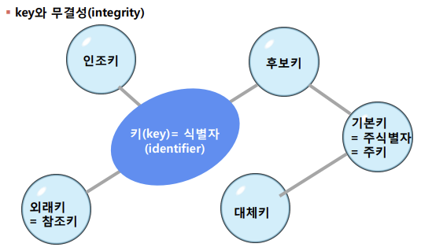

## 키의 개념 및 종류
### 후보키(candiadate key)의 개념
#### 후보키
- 릴레이션을 구성하는 속성들 중에서 튜플을 유일하게 식별하기위해 사용하는 속성들의 부분집합
- 기본키로 사용할 수 있는 속성들을 의미함

#### 특징
#### 유일성(Unique)
- 하나의 키 값으로 하나의 튜플만을 유일하게 식별할 수 있어야 함
#### 최소성(minimality)
- 모든 레코드들을 유일하게 식별하는데 꼭 필요한 속성으로만 구성되어야 함

### 기본키(primary key)의 개념
#### 기본키
- 기본키는 후보키 중에서 선택한 main key
- 한 릴레이션에서 특정 튜플을 유일하게 구별할 수 있는 속성임

#### 특징
1. Null 값을 가질 수 없음.
2. 기본키로 정의된 속성에는 동일한 값이 중복되어 저장될 수 없음.

### 대체키(alternate key)의 개념
#### 대체키
- 후보키가 둘 이상일 때 기본키를 제외한 나머지 후보키들을 말함
- 보조키라고도 함
  
### 슈퍼키(super key)의 개념
#### 슈퍼키
- 유일성만 있고 최소성이 없는 애트리뷰트 집합
- 한 릴레이션 내에 있는 속성들의 집합으로 구성된 키

### 외래키(foreign key)의 개념
- 관계를 맺고 있는 릴레이션 R1, R2에서 릴레이션 R1이 참조하고 있는 릴레이션 R2의 기본키와 같은 R1 릴레이션의 속성을 외래키라고 함
   - 관계형 데이터 모델에서 외래키는 참조되는 릴레이션의 기본키와 대응되어 릴레이션 간에 참조 관계를 표현하는데 중요한 도구임
   - 외래키로 지정되면 참조 릴레이션의 기본키에 없는 값은 입력할 수 없음

## 무결성(integrity)
### 무결성의 정의
- 데이터베이스에 저장된 데이터 값과 그것이 표현하는 현실 세계의 실제 값이 일치하는 정확성
  
### 제약조건(constraint)
- 데이터베이스에 저장된 데이터의 정확성을 보장하기 위해 정확하지않은 데이터가 데이터베이스 내에 저장되는 것을 방지하기 위한 제약조건
  
### 종류
  1. NULL 무결성 : 릴레이션에서 특정 속성 값이 NULL이 될 수 없도록 하는 규정
  2. 고유(unique) 무결성 : 릴레이션의 특성 속성에 대해 각 튜플이 갖는 속성 값이 서로 달라야 한다는 규정
  3. 도메인(domain) 무결성 : 특정 속성의 값이 그 속성이 정의한 도메인에 속한 값이어야 한다는 규정
   >> ex) 대학교 학년의 도메인을 1,2,3,4로 함으로써 하나의 속성에서 취할 수 있는 모든 가능한 원자 값들의 집합
   4. 키(key) 무결성 : 하나의 릴레이션에는 적어도 하나의 키가 존재해야 한다는 규정
   5. 참조(referential) 무결성 : 외래키 값은 NULL이거나 참조 릴레이션의 기본키 값과 동일해야 한다는 규정(릴레이션은 참조할 수 없는 외래키 값을 가질 수 없음)
       - 외래키와 참조하려는 테이블의 기본키는 도메인과 속성 개수가 같아야 함
   6. 개채(entity) 무결성 : 기본 릴레이션의 기본키를 구성하는 어떤 속성도 NULL일 수 없다는 규정

### key와 무결성

### 무결성 제약조건

