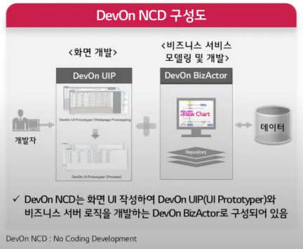
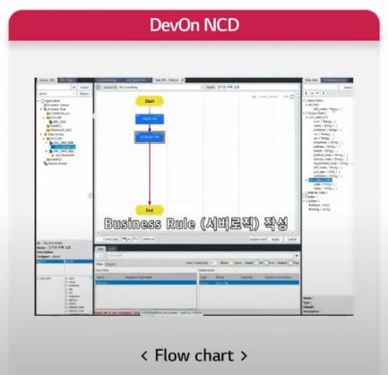
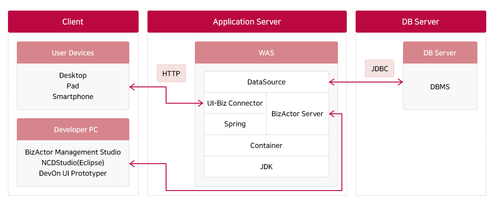
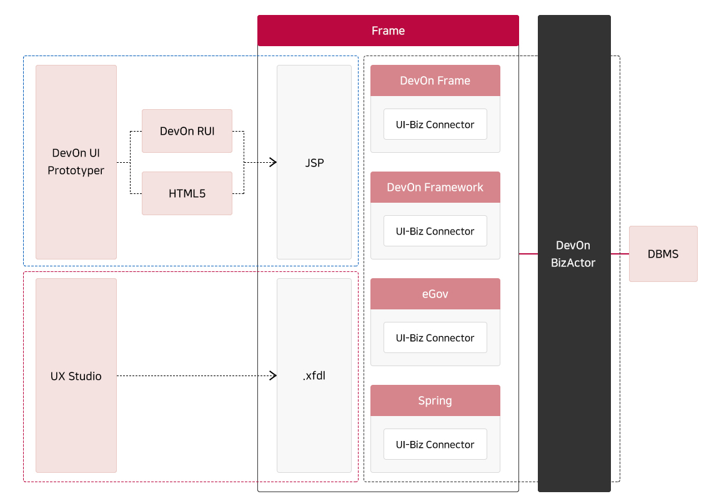

# DevOn NCD 
- DevON : 브랜드명
- NCD : No Coding Development 
- 기본 구성은 다음과 같다. 
- 결국엔 Flow Chart 를 이용한 개발 비즈니스 모델링 작업 
 

- 파워포인트처럼 화면을 그리면 동작 가능한 화면 프로그램이 생성이 가능함

---
## 장점
- 서비스 설계 및 개발이 동시에 이뤄지며, 즉각적인 테스트를 통하여 검증이 가능함
- 구축환경과 실시간 반영이 가능한 운영 환경을 동시에 제공함
- 개발 언어 모르는 사용자도 중급 수준의 개발이 가능함
- 초급개발자도 균일한 소스 품질 확보가 가능함
- Flow 기반 Visual 구현을 통한 가시성 및 직관성이 높음

---
## 솔루션 아키텍처

## 툴 오버레이
