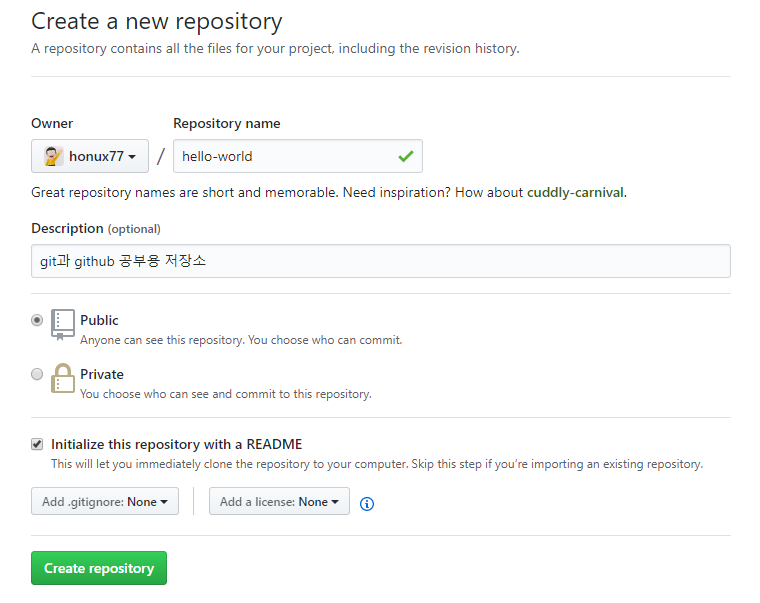
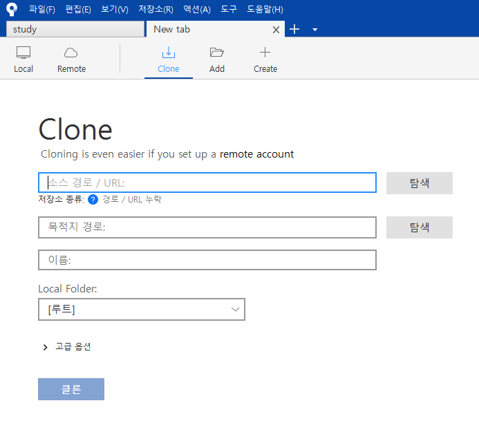
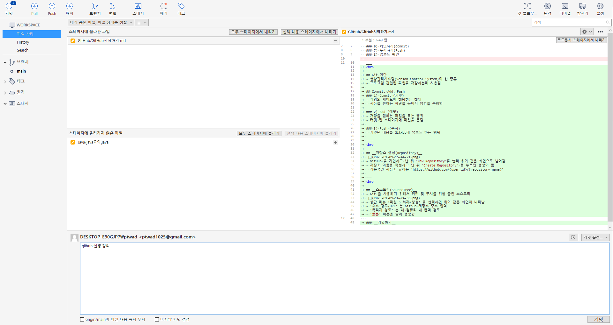

# __1. GitHub 초기 절차__
### 1) github 가입하기
### 2) github 저장소 생성
### 3) github 저장소 클론
### 4) 디렉토리 파일 생성 및 작업 완료
### 5) 커밋 파일 스테이지 올리기(Add)
### 6) 커밋하기(Commit)
### 7) 푸시하기(Push)
### 8) 업로드 확인
___
 

## Git 이란
- 형상관리시스템(Verson Control System)의 한 종류
- 프로그램 관련된 파일을 저장하는데 사용됨

## Commit, Add, Push
### 1) Commit (커밋)
- 게임의 세이브에 해당하는 행위
- 저장을 원하는 파일을 묶어서 명령을 수행함

### 2) Add (에딧)
- 저장을 원하는 파일을 묶는 행위
- 커밋 전 스테이지에 파일을 올림

### 3) Push (푸시)
- 커밋된 내용을 GitHub에 업로드 하는 행위

----
 

## __저장소 생성(Repository)__
- GitHub 을 가입하고 난 뒤 "New Repository"를 눌러 위와 같은 화면으로 넘어감

- 저장소 이름을 작성하고 난 뒤 "Create Repository" 를 누르면 생성이 됨
- 기본적인 저장소 규칙은 'https://github.com/{user_id}/{repository_name}' 

---
 

## __소스트리(SourceTree)__
- Git 을 사용하기 위해서 커밋 및 푸시를 위한 툴인 소스트리

- 상단 메뉴 '파일 > 복제/생성' 을 선택하면 위와 같은 화면이 나타남
- '소스 경로/URL' 는 Github 저장소 주소 입력
- '목적지 경로' 는 내 컴퓨터 내 폴더 경로
- '클론' 버튼을 눌러 생성함

### __커밋하기__
- 좌측 'Workspace' 를 선택하고 난 뒤 변경 사항을 확인하고 해당 소스를 선택
- 좌측 상단 '커밋'을 선택함, 아래와 같은 화면으로 이동

- 변경된 소스를 '스페이지'에 올림
- 하단 코멘트(comment) 작성, 어떤 소스에 어떤 부분이 변경되었는지 상세 작성함
- 우측 하단 '커밋' 블록을 선택하여 커밋함
- 그 후 상단 'Push' 을 선택하여 GitHub 저장소에 저장함

