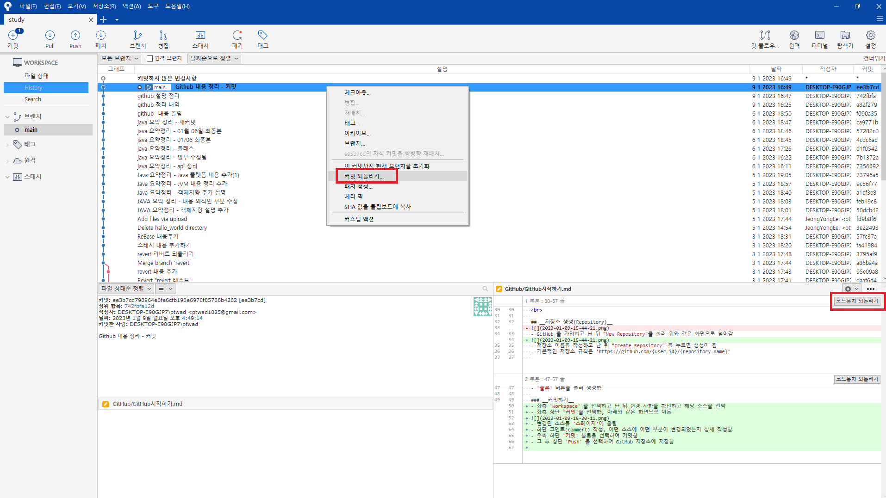
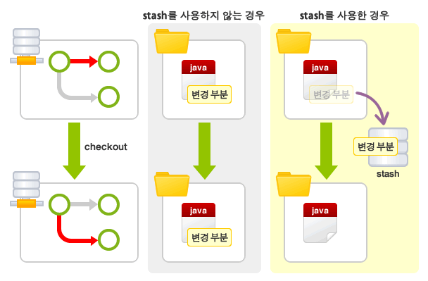
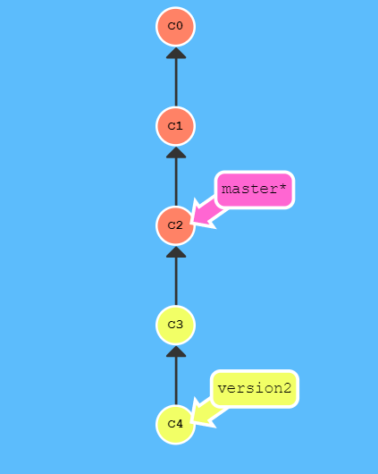
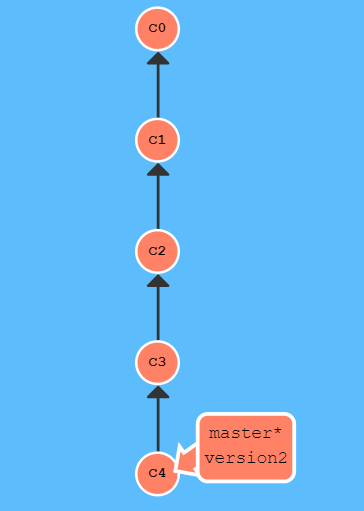
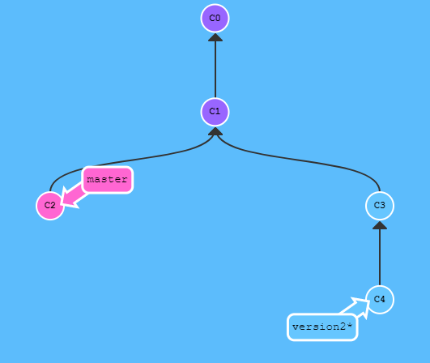
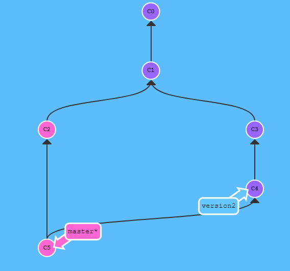

# __1. GitHub 절차__
### 1) github 가입하기
### 2) github 저장소 생성
### 3) github 저장소 클론
### 4) 디렉토리 파일 생성 및 작업 완료
### 5) 커밋 파일 스테이지 올리기(Add)
### 6) 커밋하기(Commit)
### 7) 푸시하기(Push)
### 8) 업로드 확인
___
 

## __Git 이란__
- 형상관리시스템(Verson Control System)의 한 종류
- 프로그램 관련된 파일을 저장하는데 사용됨

## __Commit, Add, Push__
### 1) Commit (커밋)
- 게임의 세이브에 해당하는 행위
- 저장을 원하는 파일을 묶어서 명령을 수행함

### 2) Add (에딧)
- 저장을 원하는 파일을 묶는 행위
- 커밋 전 스테이지에 파일을 올림

### 3) Push (푸시)
- 커밋된 내용을 GitHub에 업로드 하는 행위

----
 

## __저장소 생성(Repository)__
- GitHub 을 가입하고 난 뒤 "New Repository"를 눌러 위와 같은 화면으로 넘어감

- 저장소 이름을 작성하고 난 뒤 "Create Repository" 를 누르면 생성이 됨
- 기본적인 저장소 규칙은 'https://github.com/{user_id}/{repository_name}' 

---
 

## __소스트리(SourceTree)__
- Git 을 사용하기 위해서 커밋 및 푸시를 위한 툴인 소스트리

- 상단 메뉴 '파일 > 복제/생성' 을 선택하면 위와 같은 화면이 나타남
- '소스 경로/URL' 는 Github 저장소 주소 입력
- '목적지 경로' 는 내 컴퓨터 내 폴더 경로
- '클론' 버튼을 눌러 생성함

### __1) 커밋하기__
- 좌측 'Workspace' 를 선택하고 난 뒤 변경 사항을 확인하고 해당 소스를 선택
- 좌측 상단 '커밋'을 선택함, 아래와 같은 화면으로 이동

- 변경된 소스를 '스페이지'에 올림
- 하단 코멘트(comment) 작성, 어떤 소스에 어떤 부분이 변경되었는지 상세 작성함
- 우측 하단 '커밋' 블록을 선택하여 커밋함
- 그 후 상단 'Push' 을 선택하여 GitHub 저장소에 저장함
- Github 저장소에 접속하여 해당 변경사항을 확인함

> #### (주의사항)
- 한 번에 하나의 논리적인 작업 내용만 커밋함
- 커밋 내용을 대충하지 말고 반드시 설명이 잘되어 있어야 됨
- 커밋 메세지(내용) 작성 요령 
(1) 첫 줄에 간단, 명확한 내용 기입  
(2) 한줄 비우고 상세 내용을 작성함  

 

### __2) 변경 내용 되돌리기(취소하기)__
- 변경 사항이 적용된 내용을 되돌리기 위해선 두 가지 방법이 있음

- 변경 사항이 적용된 부분에 우클릭 후 '커밋 되돌리기' 를 선택함
- 혹은 우측 하단에 '코드뭉치 되돌리기' 부분을 선택함 
 

### __3) 브랜치(Branch)__

- 공통으로 사용하는 소스에서 다른 부분에 대해서 수정해야 될 사항이 발생할 때, 각자 다른 버전의 소스를 가지고 작업하는 편이 편하다. 
- 위와 같은 상황에서 사용할 수 있는 것이 브랜치(Branch)이다.
- 브랜치로 별도 버전을 생성하고 난 뒤 공통 소스에 병합을 하면서 자신이 작업한 내용만 업데이트(커밋)이 가능하다.  
- 해드 브랜치(head Branch)는 최초 생성된 브랜치, 기본 설정된 Repository 가 된다.
- 토픽 브랜치 (Topic Branch)는 버그 수정, 기능 추가 등 단위 작업을 위한 브랜치
- 체크아웃(Checkout) 기능으로 해드 브랜치에서 토픽으로 브랜치를 이동할 수 있다.

### __4) 스테시__
- 커밋하지 않은 변경 내용이나 새롭게 추가한 파일이 인덱스와 작업 트리에 남아 있는 채로 다른 브랜치로  전환(Checkout)하면, 그 변경 내용은 기존 브랜치가 아닌 전환된 브랜치에서 커밋할 수 있으나 이러한 상황일 때에 커밋 가능한 변경 내용 중에 전환된 브랜치에서도 한 차례 변경이 되어 있는 경우에는 체크아웃이 실패할 수 있다. 
- 위와 같은 상황인 경우 이전 브랜치에서 커밋 하지 않은 변경 내용을 커밋하거나, stash 를 이용해 일시적으로 변경 내용을 다른 곳에 저장하여 충돌을 피하게 한 뒤 체크아웃해야됨.
- 따라서, 스태시(stash)는 파일의 변경 내용을 일시적으로 저장하는 영역이다.

- 위의 그림을 참고하면 스태시(stash)를 이해할 수 있다.  

 

### __5) 브랜치 병합하기__
- 기능 추가나 버그 수정 등 변경처리가 완료된 소스를 최종적으로 해드 브랜치에 병합하는 작업이 필요함.
---
- 상황 1)  

- 수정 처리된 브랜치가 해드 브랜치 인 경우
- 위와 같은 상황을 'fast-forward'이라고 하며 주로 혼자 작업할 때에 발생함
- 단순하게 'version2' 내용을 'master'로 병합하면 된다.  
- 아래 처럼 병합처리하면 완료된다.  
 

---

- 상황 2)  

- 해드 브랜치에 직접 수정이 불가능하고 브랜치가 가지처럼 생겨난 경우
- 과거에 브랜치를 받아서 'version2' 브랜치를 생성한 경우라면 위와 같이 발생할 수 있다.
- 이런 경우에는 해드 브랜치에서 타겟 브랜치를 병합하면 되긴 하지만, 여러 브랜치에서 동시에 변경한 파일이 있는 경우 충돌이 발생할 가능성이 크다. 
- 보통 가장 최신 내용 하나만 선택하면 되는 경우가 많고 최신 내용은 타겟 브랜치에 있는 경우가 많음으로 최신 브랜치에 대해서 병합하여 진행하면 된다. 

- 결과적으로 최신의 타겟 브랜치를 위와 같이 병합 진행하면 된다.

---

### __6) 브랜치 충돌(Conflict)__
- 자동 병합이 실패하였거나 두 커밋이 같은 파일을 편집한 경우 발생함
- 충돌 해결 방법은 아래와 같다.  

    (1) 에디터 이용하기  
    (2) 병합툴을 이용하기  
    (3) SourceTree를 이용하기  
     
    - 소스 트리에서 충돌이 발생한 경우, 마우스 우클릭을 통하여 '충돌 해결' 버튼을 눌러 해결 할 수 있다.  

 

- 서버의 내용이 내 PC 보다 최신인 경우 pull 을 적용한다.
- 충돌에 대해선 좀 더 이해도를 높일 필요가 있어 보인다.

