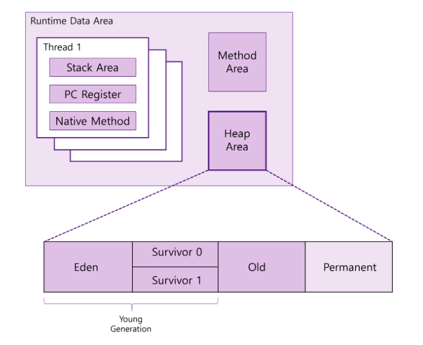

# JAVA 기본 요약 
## JDK (Java Development Kit)
- 자바에 필요한 클래스(class), 컴파일(compile), 실행(execution), 배포(deployment) 등 개발에 필요한 환경도구를 JDK라 칭함
 1) JDK : 개발도구
 2) JRE : 실행환경
 3) JVM : 가상머신(실제 실행영역)

## 자바 표기법
 1) 파스칼 표기법 : 첫 단어에 대문자, 클래스명이나 인터페이스 명에 사용됨 (예) class Car() , class Support() 등 
 2) 카멜 표기법 : 단어 사이에 대문자, 메소드 이름이나 변수명에 사용됨 (예) void speedUp()

(ex) 이 밖에도 많은 표기법이 있으나 대표적으로 위 두 가지가 있다.

## 자바의 기본적인 객체 모델
 1) 클래스 (예) 자동차
 2) 변수 (예) 자동차 색깔, 부품 이름
 3) 매소드 (예) 가속, 감속, 브레이크 등 동적 행위

## main, static 
1. main : JVM이 객체를 호출할 때에 진입점 역할을 수행함
    1. JVM 영역
         
         (1) Method 영역
        
         (2) Heap 영역
        
         (3) Stack 영역
        
        여기서, Static 선언을 하게 되면 Heap 영역이 아닌 Methon, Stack 영역으로 메소드가 형성이 되면서 정상 실행이 된다. 만약 main 에 static 이 선언되어 있지 않다면 JVM 과 메모리 상의 구조적인 문제가 발생될 가능성이 크다.

    2. Package / Import
        
        (1) Package
        
        모든 클래스는 패키지라는 고유 주소를 가지고 있음 , 일반적으로 클래스의 고유 주소를 나타내기 위해서 "패키지명+클래스명" 형태로 표기함
        
        (2) Import
        
        클래스 내부에서 다른 클래스의 위치를 표현하기 위해 사용함. 다만, java.lang. 내부에 속해져 있는 클래스의 경우엔 import 가 생략될 수 있다.

# 객체지향
## 기본 속성
1) 상속성
- 상위 클래스(부모 클래스)의 특징을 하위 클래스(자식 클래스)가 모두 물려받는 것을 말함
- 이때, 자식 클래스는 부모가 가지고 있는 멤버 변수와 메소드를 모두 물려받아 사용이 가능함
- 쉬운 용어로 상속관계 혹은 계층구조로 불림

2) 캡슐화
- 세부 구조는 숨기고 접근할 필요가 있는 부분만 노출하는 것, 대표적인 예로 라이브러리가 있다.
- 프로그램의 복잡도를 줄이는 데에 큰 역할을 함
- private 에서 public 으로 갈수록 접근 가능 범위가 커짐 (private > default > protected > public)
- private : 외부 객체 접근 불가, default : 같은 패키지의 객체만 접근 가능, protected : 상속 관계의 객체만 접근 가능, public : 모든 객체에서 접근 가능

3) 추상화
- 객체의 공통적인 특징을 추출하는 과정으로 다음과 같다.
    
    (1) 객체들의 공통적으로 가지고 있는 개념을 추출함

    (2) 공통 개념이 추출되면, 추출한 개념을 이용한 최소한의 기능을 가진 상위 개념 객체를 생성함

    (3) 상위 개념의 객체를 상속받아 구현을 함


4) 다양성
- 객체 간의 결합도를 줄이기 위해 OOP(객체 지향 프로그래밍, Object-Oriented Programming)에 도입된 개념
```java
public class MainRun{

    public void inCome(Animal a){
        a.sound();
    }

    public static void main(String args[]){

        MainRun run = new MainRun();

        Animal cat = new Cat(); // 부모클래스 타입으로 레퍼런스 생성
        Animal dog = new Dog(); // 부모클래스 타입으로 레퍼런스 생성

        run.inCome(cat);
        run.inCome(dog)
    }
}
```
- 하위 클래스인 Doc, Cat 은 각각 상위 클래스인 Animal 클래스를 상속 받아 구현됨
- 실행 시 cat 변수는 상위 클래스 타입인 Animal 타입의 레퍼런스로 Cat 타입의 객체를 연결함, Dog 도 마찬가지다.
- 실제 데이터를 처리하는 inCome() 메소드를 살펴보면 인자 값으로 Animal 타입의 객체를 받아서 처리함
- 위 코드가 정상 작동하는 이유는 상위 클래스인 Animal 타입의 변수로 선언하였기 때문이다.
- 이와 같이 설명하는 이유는 객체 간의 결합도를 줄이기 위하여 사용되는 다양성을 설명하기 위함이다.


# JVM 메모리 구조

## JVM 영역



### 1.메소드(Method) 영역
- 런타임 시 생성된 모든 스레드가 공유하는 영역
- 기본적으로 할당받는 메소드 영역의 메모리 사이즈는 일정하게 정해져 있다.
- 기본 구성은 아래와 같다.
1) 클래스로더에서 읽어들인 바이트 코드를 저장해 두고 바이트 코드를 이용해 모든 클래스를 분석함
2) 클래스 분석이 완료되면 클래스 정보, 메소드 정보 등을 생성하고 생성된 정보를 이용하여 Static 변수를 생성함

### 2.스택(Stack) 영역
- JVM 스택, 호출 스택 등의 다양한 이름으로 불림
- JVM 스택은 프로세스 내부에 생성된 스레드 마다 생성되며 메소드 동작을 위한 메모리 공간을 제공함
- 해당 스택(Stack) 영역에 메소드 정보, 지역 변수 정보 파라미터 값 등이 저장됨
- 호출된 메소드가 실행되면 스택 프레임이라는 자료 구조가 생성되고, 실행 순서에 따라 스택 동작을 수행하다가 모든 동작이 완료되면 메모리에서 사라진다.

### 3.힙(Heap) 영역
- 새로운 키워드로 객체를 생성하면 생성된 객체는 힙(Heap) 영역에 저장됨
- 런타임 시 생성되는 객체를 저장하는 공간
- 메모리상의 쓰레기를 제거하는 작업, 불필요한 메모리 공간을 정리하는 역할을 수행함


# Java 플랫폼

## Java SE 
- 가장 기본적인 환경(사용자 PC)에서 동작하는 프로그램을 개발하기 위한 자바 플랫폼
- 기본적인 API와 컴파일러, 실행 환경 등을 포함함
- Java SE에 포함된 API는 가장 기본적인 것으로 모든 API의 근간이 되는  Base API이다.
- Java SE 는 JDK 와 JRE 로 구성되어 있다.

## Java EE
- 대량의 리소스를 사용하는 기업용 프로그램을 제작하는데 적합한 API로 구성되어 있다.
- 자바 기반의 웹 프로그램을 작성하기 위한 Servlet이나 JSP, 대량의 트랜잭션 처리를 위한 EJB 같은 API가 제공됨
- JDK와 같은 API를 제공하지 않기 때문에 Java EE API를 사용하려면 Java EE 명세를 실제 구현한 구현체를 함께 사용해야 된다.
- WAS 제품들이 Java EE 명세를 모두 구현하고 있기 때문에 Java EE 가 제공하는 API는 WAS 환경에서만 실행이 가능하다.

## Java ME
- 모바일 환경에서 자바 기반의 프로그램을 제작하는 데 적합한 API로 구성되어 있음
- 오라클에서 모바일용 SDK를 별도로 지원하고 있음

# Java Development Kit (JDK)

## 기본 툴 종류
- java : 실제 자바 프로그램을 실행시키는 도구
- javac : 자바 소스 코드를 컴파일하는 도구
- javadoc : API 문서를 생성해주는 APJ 문서 생성 도구
- jdb : 자바 소스 디버깅 도구
- jar : 자바 Archive(JAR) 파일 생성 도구
- appletviewer : 애플릿을 간단하게 실행해주는 도구

## Java API
- 프로그램을 위한 기본적인 API들로 구성되어 있음 ,API 라는 것은 라이브러리로 생각하면 됨
- 대표적인 API는 다음과 같다.
1. java.lang 패키지 : 자바에서 사용되는 가장 기본이 되는 클래스를 담고 있다.
2. java.util 패키지 : 유틸리티 클래스들로 이루어짐, (예) Arrays, Date, Object 등
3. java.io 패키지 : 입력/출력 작업을 위한 클래스들로 이루어짐, (예) File, Filereadeer, FileWriter 등
4. java.sql 패키지 : 데이터 베이스 연동을 위한 클래스들을 제공하는 패키지

