# MsSQL 설치
## 1) 공식 홈페이지
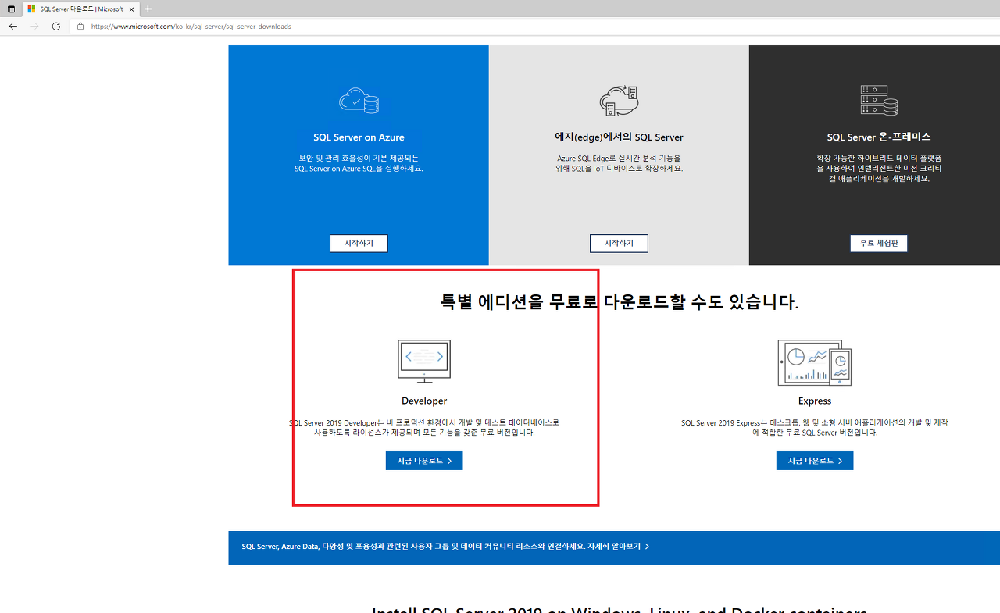
- https://www.microsoft.com/ko-kr/sql-server/sql-server-downloads
- 위 사이트에서 MsSQL 설치 파일을 다운로드함

## 2) 설치 과정
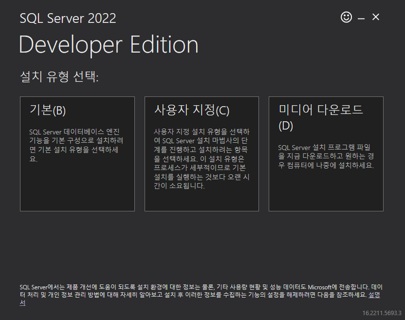
- 다운로드 된 설치파일을 눌러서 '사용자 지정'을 선택함
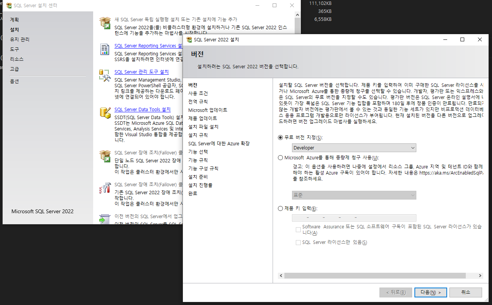
- 좌측 '설치' > '새 SQL Server .. '  선택합니다.
- 중간 'Azure 확장' 체크 해제
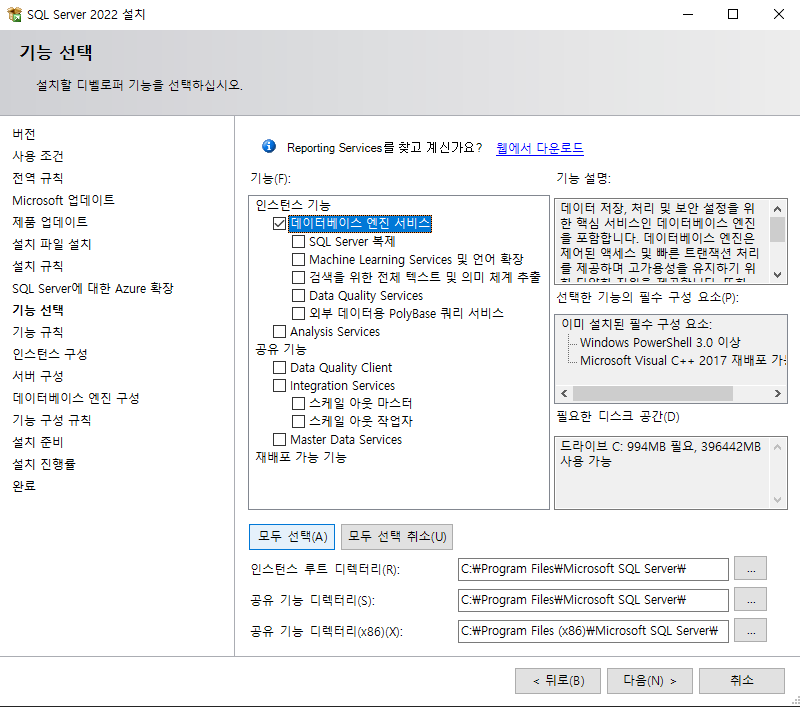
- 인스턴스 기능 > '데이터 베이스 엔진 서비스' 체크
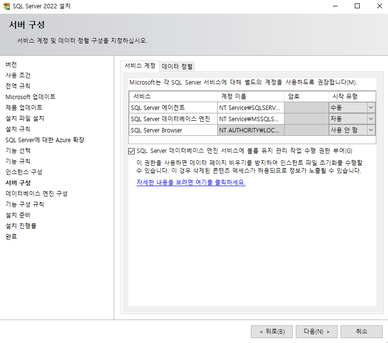
- SQL Server 데이터베이스 엔진 서비스 권한 부여 체크
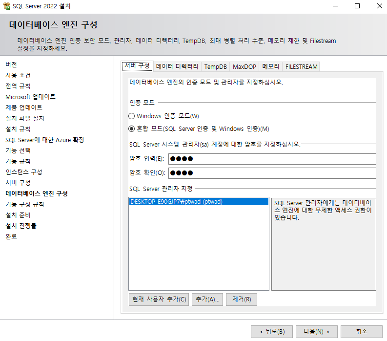
- 데이터베이스 엔진 구성, 인증 모드(혼잡 모드 체크) > 암호 지정 후 SQL Server 관리자 지정 (현재 사용자 추가)
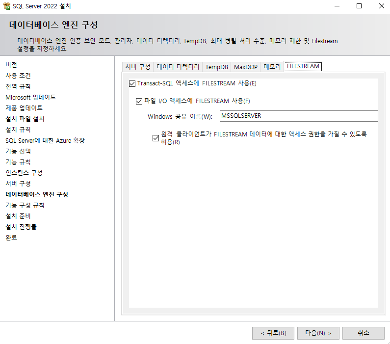
- 데이터베이스 엔진 구성 중 'FILESTREAM' 부분에서 'Transact-SQL 액세서에 ...' 체크
- 마지막 원격 클라이언트 액세스 권한 허용을 체크함
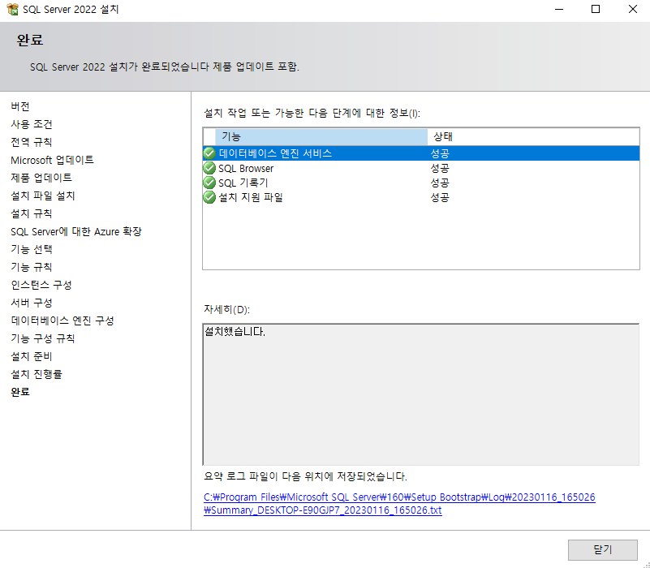
- 정상 설치 완료를 확인함

---

# DBeaver 연결
## 1) SQL Server Configuartion Manager(SQL Server 구성 관리자) 설정
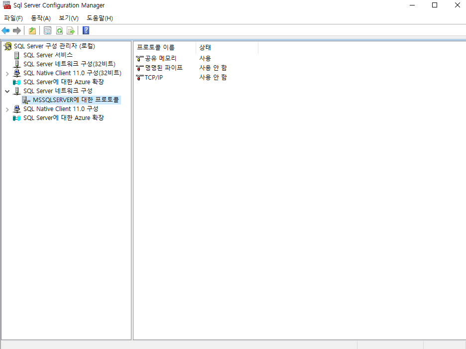
- SQL 서버 구성 관리자 내용 중 네트워크 구성에서 'TCP/IP' 부분 사용안함을 사용으로 변경함
- 'IPAII' 포트는 '1433' 으로 설정함

## 2) DBeaver 설정
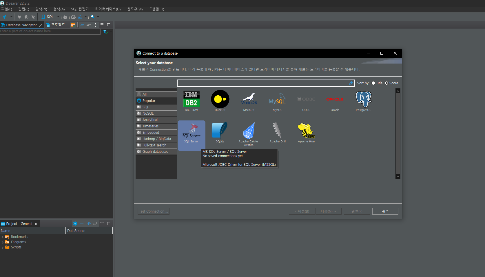
- 상단 콘센트 모양을 눌러 연결 구성을 설정함
- 많은 연결 구성 중 SQL Server 를 선택함
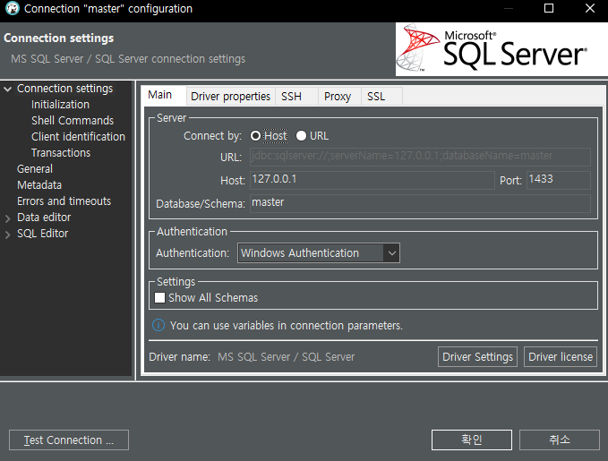
- 'Authentication' 부분에서 'Windows Authentication' 을 선택함
- 만약, 별도 SQL 계정이 정해진 경우 ID/PW 을 입력하면 된다.
- '확인'을 누르기 전 'Test Connection' 을 눌러 테스트를 진행함

## 3) 전체 테이블 및 필드 조회
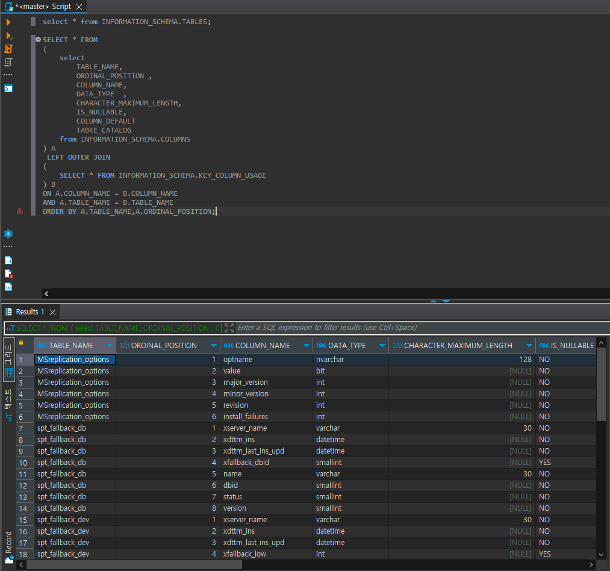
- 아래와 같은 SQL 문을 작성하면 된다.
- 오라클과 다르게 별도 스키마로 관리됨 (INFORMATION_SCHEMA) <BR>
```sql
SELECT * FROM INFORMATION_SCHEMA.TABLES;
```
- 필드 확인은 아래와 같다.
```sql
SELECT * FROM 
(
    select 
        TABLE_NAME, 
        ORDINAL_POSITION , 
        COLUMN_NAME,
        DATA_TYPE  , 
        CHARACTER_MAXIMUM_LENGTH,
        IS_NULLABLE,
        COLUMN_DEFAULT
        TABKE_CATALOG
    from INFORMATION_SCHEMA.COLUMNS
) A
 LEFT OUTER JOIN 
( 
    SELECT * FROM INFORMATION_SCHEMA.KEY_COLUMN_USAGE  
) B 
ON A.COLUMN_NAME = B.COLUMN_NAME 
AND A.TABLE_NAME = B.TABLE_NAME
ORDER BY A.TABLE_NAME,A.ORDINAL_POSITION;
```
- 결과
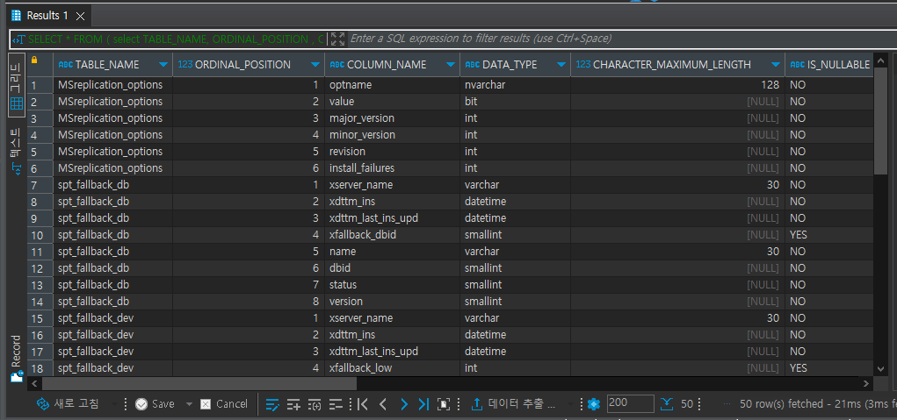