# 1.실행계획(Execution Plan)
## 1) 정의
- SQL 구문을 처리하기 위해 사용되는 연산 방법이나 오브젝트를 읽어내는 순서 등이 조합된 일련의 처리 절차

## 2) 특징
- 비용을 계산하여 가장 최적이라 판단되는 계획이 선택됨
- 작성 방법,통계 정보, 혹은 사용자가 설정한 옵션 등의 다양한 이유로 최적의 실행 계획이 아닐수 있음
- SQL 처리 리소스를 확인 가능함
- ssms 실행 계획 예시) 
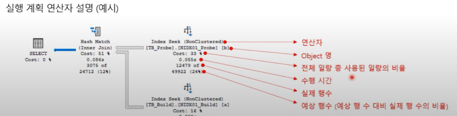

## 3) 확인 방법
- 예상 실행 계획 : 각 연산자의 속성 정보를 통해 SQL이 수행되기전에 미리 계획을 확인함
- 실제 실행 계획 : SQL이 실제로 수행된 정보를 출력하며 리소스 사용량 메트릭 및 런타임 정보 포함
- 그래픽 예상 실행 계획(Ctrl + L 혹은 상단 아이콘 선택)
- 그래픽 실제 실행 계획(Ctrl + M 혹은 상단 아이콘 선택)
- 텍스트 예상 실행 계획(SET SHOWPLAN_ALL ON/FF 로 실행가능)
- 텍스트 실제 실행 계획(SET STATISTICS PROFILE ON/FF 로 실행가능)

## 4) 실행 계획 읽는 법 
- 상단에서 하단순으로 읽음
- 진행 방식이 어떤지 논리적으로 이해하는 것이 중요함 
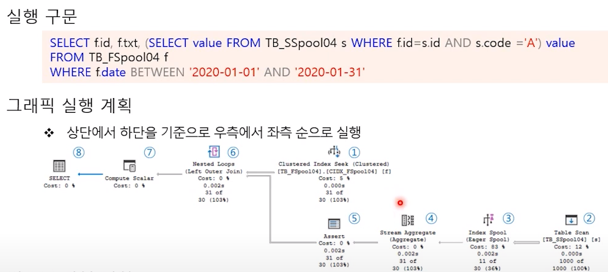

## 5) 처리과정
- 단일문 : 하나의 테이블만 읽어내어 결과 출력
- 조인문 : 두 테이블 이상의 결합ㅎ하여 하나의 결과 집합을 만듬
- 집계함수 : 조건을 만족하는 데이터를 기준으로 합계, 평균, 최소/최대 값 등 출력
- GROUP BY : 특정 열을 기준으로 행을 집계
- ORDER BY : 특정 열을 기준으로 행을 정렬

---
# 2. 인덱스
## 1) 정의
 - 무작위로 저장된 데이터 집합에서 원하는 데이터를 빠르게 찾을 수 있도록 하는 오브젝트
 - 생성 시에 B-Tree 형태의 구조를 가짐

## 2) 종류
### (1) 클러스터형 인덱스
 - clustered index : B-Tree 를 형태를 가지는 일반적인 index
 - 테이블 당 한개만 생성이 가능함
 - 행 데이터를 인덱스로 지정한 열에 맞춰 자동으로 정렬됨
 - ID 컬럼이 인덱스인 경우 다음과 같이 저장됨 
 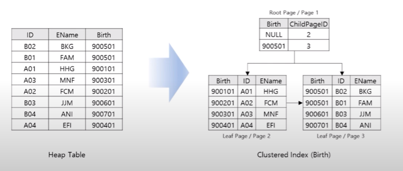

 ### (2) 비클러스터형 인덱스
- Non-Clustered index : 데이터 테이블(Heap Table)과 독립적으로 생성
- 테이블 당 여러 개를 만들 수 있음 
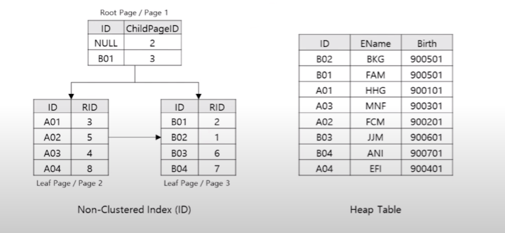

### (3) 내부 동작
- B-Tree 
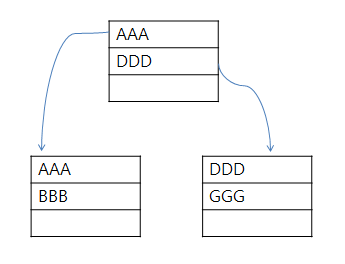

- 데이터 입력시 
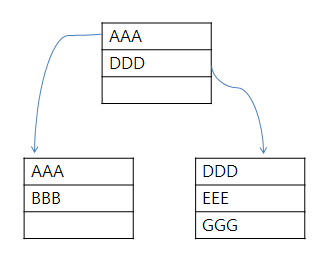

- 신규 인덱스 데이터 입력시  
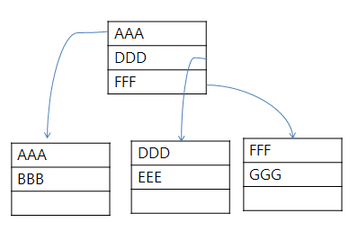

# 3. 데이터 탐색 방법
## 1) SCAN (스캔)
### (1) Table Scan
 - 조건에 맞는 데이터를 색인하는 것보다 모든 데이터를 읽ㅇ는 것이 더 효율적일대 사용함
 - Clustered Index가 존재한다면 Clustered Index Scan 으로 변경됨 
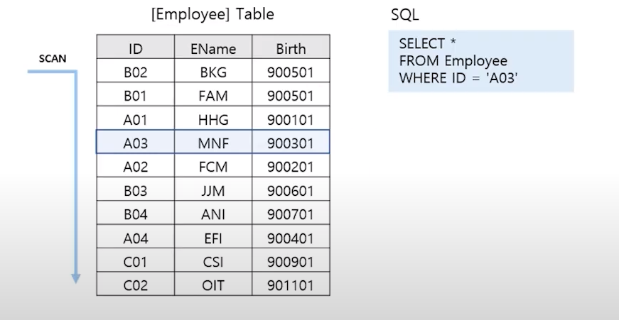
 - 위 스크린 샷처럼 중간에 'A03'이 있음에도 현재 인덱스나 테이블이 정렬 상태가 아님으로 테이블 전체에 대해서 확인할 필요가 있다.

 ### (2) Clustered Index Scan
 - Clustered Index  의 Leaf 페이지를 모두 탐색해야됨
 - 인덱스 컬럼을 가공하거나 선두 컬럼에 대한 검색 조건이 없을 경우 발생함 
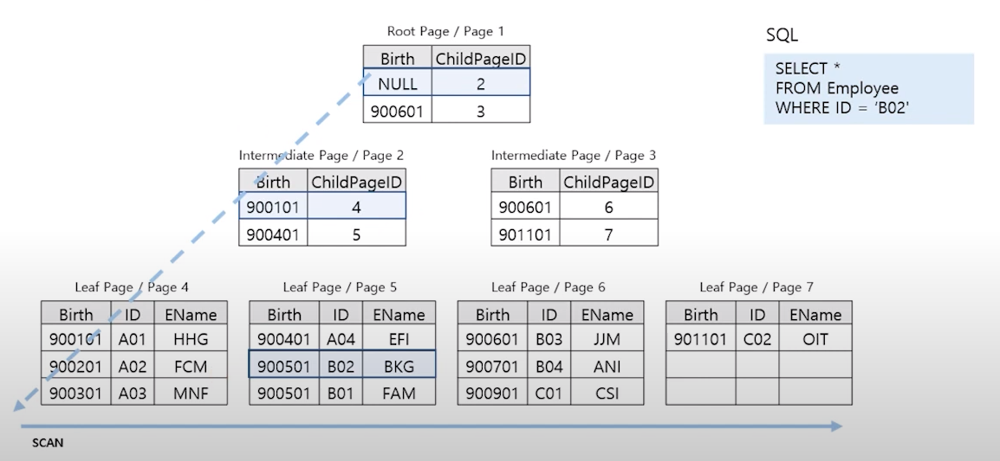

### (3) Clustered index Seek
- 인덱스의 Root 부터 Leaf 까지 필요한 페이지만 수직적으로 탐색하는 방법
- 조건에 제시된 열이 Clustered Index에 포함되는 경우 Clustered Index Seek 발생함 
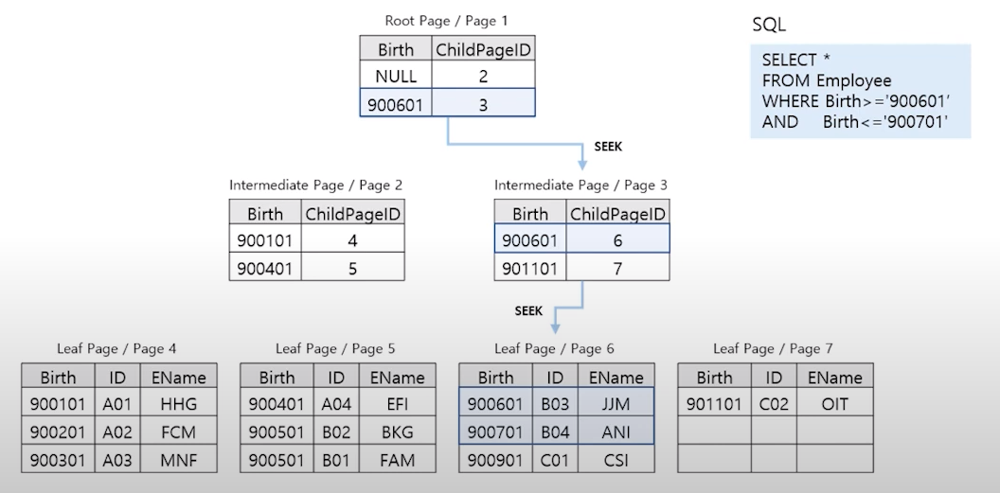

### (4) Non-Clustered Index Scan
- Non-clustered Index의 Leaf 페이지를 모두 탐색하는 방식
- 인덱스 컬럼을 가공하거나 선두 컬럼에 대한 검색조건이 없을 때 발생됨 
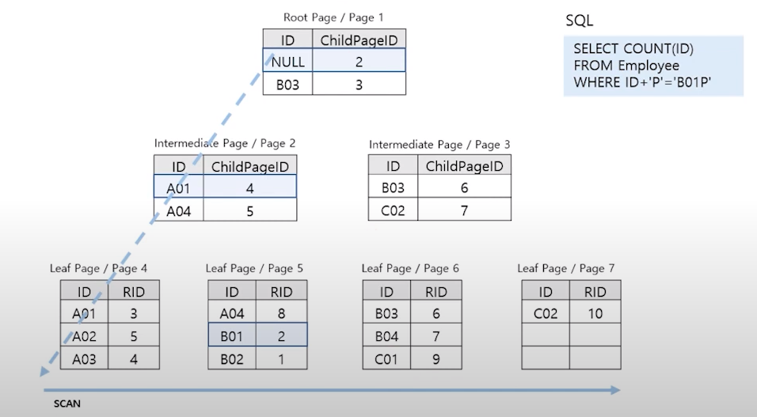

### (5) Non-Clustered Index Seek
- 인덱스의 Root 부터 Leaf 까지 필요한 페이지만 수직적으로 탐색하는 방식
- Non-Clustered Index에 포함된 열만 조회할 경우 Index Seek 이 발생함 
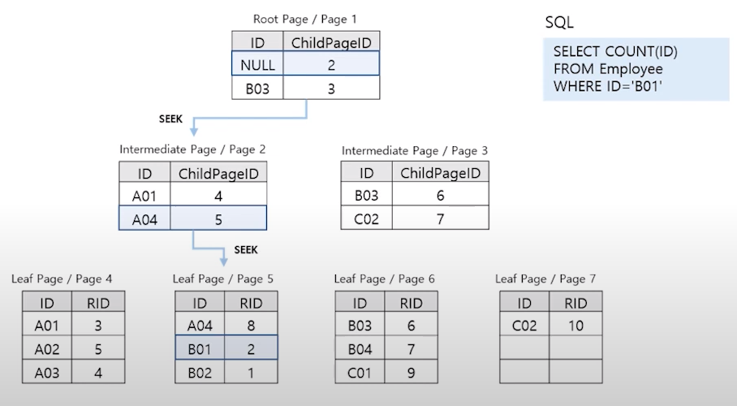

### (6) RID Lookup : Non-Clustered Index + Heap Table
- 열 데이터가 부족하여 조인을 통해 열을 가져오는 과정
- Non-Clustered Index + Heap 일 경우 RID Lookup 이 발생됨 
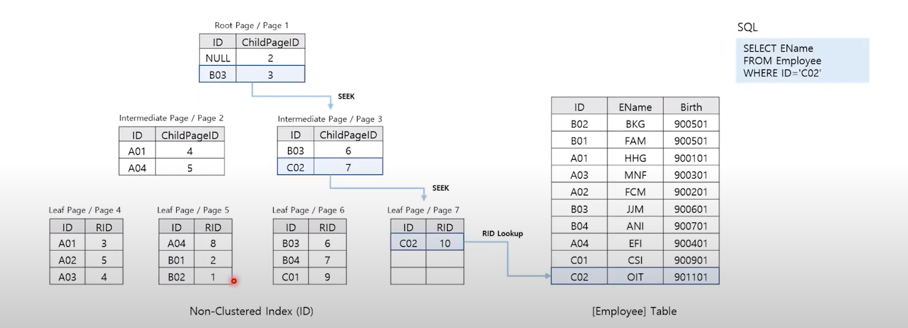