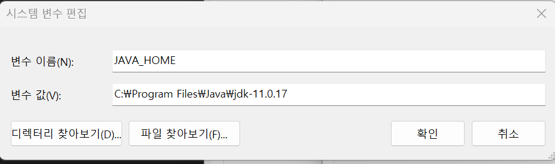
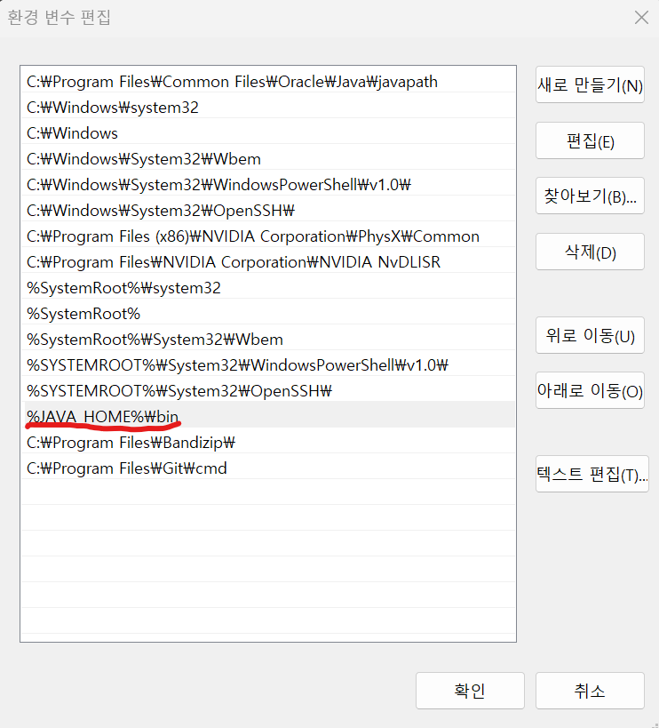
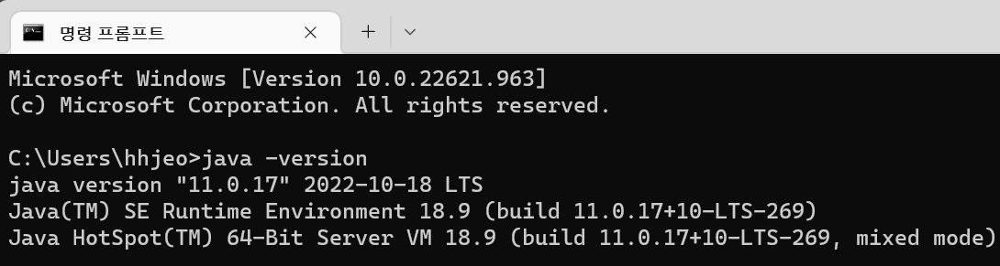

스프링부트 환경설정
===
## 1.JDK 11 설치
- JDK11을 설치하는 이유는 flux라는기술을 사용하기 위해서는 서드파티 라이브러리가 되어있는 버전을 사용해야 한다.
   ```
   JDK11 기능
    - flux 기술(reactive programing)
   
   서드파티(Thrid Party) 라이브러리
    - 외부 라이브러리가 매우 자주 사용되어 표준화되는 것
    ```
- 다운로드 http://jdk.java.net/archive/
  
### Shell script
- 하드웨어를 직접 건드리지 않고 OS가 대신 명령하게 해주는 언어
- 쉘에서 해석을 해서 커널에서 명령을 수행 후 전송
    - ex) cd dir% ...
  
## 2.환경변수 설정
   - 툴 전용 환경변수인 JAVA_HOME에 다운받은 JDK의 경로를 추가
   ```
   경로: 윈도우 검색창-> 시스템 환경 변수 편집 -> 환경변수 -> 시스템변수(새로만들기) -> 변수 이름 / 변수 값(JDK경로) 작성 후 확인
   ```
   
   

   - cmd 상에서 버전 설치 확인
   

## 3.STS 스프링 전용 툴 설치
- 설치 주소- https://spring.io/tools

### STS 웹개발 환경 설정
1. utf-8 설정
   - Preference에 들어간다. (단축키  command + ,)
   - 검색창에서 enc를 검색한다.
   - 왼쪽 메뉴 바에서 workspace 선택
   - Text file encoding을 utf-8로 변경
- utf-8 사용하는 이유
    - 전 세계 공용
    - 데이터 가변성

2. font 설정
   - Preference에 들어간다.( 단축키 : command + , )
   - 검색창에서 font를 검색한다.
   - 왼쪽 메뉴에서 color and fonts를 선택한다.
   - Basic폴더 안에 text fonts를 선택한다.
   - Edit에 들어가 원하는 폰트(CookieRunOTF)를 선택한다.

3. 플러그인 enterprise 설치
- jsp,html…등을 사용할 수 있게 만드는 플러그인
    - 메뉴바에서 Help > eclips marketplace를 열어준다.
    - 검색창에 enterprise를 검색한다.
    - install 버튼으로 설치를 시작한다.
    - 차례대로 conform -> finish를 선택한다.
    - 설치 완료되면 restart now 를 클릭하여 spring을 다시 시작한다.

#### 플러그인이란?
- 라이브러리는 프로그램이고
플러그인에 어떤 툴을 쓸때 필요한 서브툴

#### 템플릿 엔진이란?
- jsp와 같이 html에서 자바 코드를 사용하기 위한 것
그외 머스태치, 타임리프 등이 있다.
- 템플릿 엔진을 잘 안쓰는 추세인데 그 이유는 ajax로 주로 사용하기 때문이다.
