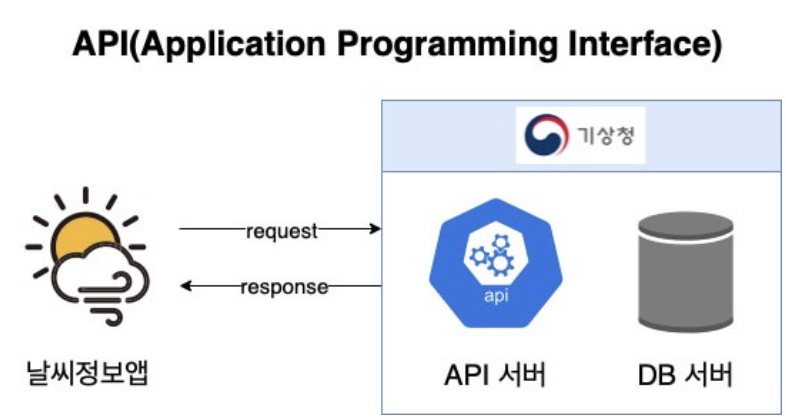

기본개념 정리
==
# 1. 스프링
## 1) 스프링은 프레임워크이다.
- 개발자들에게 개발틀을 제공하여 개발 패턴을 일정하게 만드는 것으로 개발을 보다 쉽게 할 수 있다.
## 2) 스프링은 오픈소스이다.
- 오픈 소스란 소스 코드를 공개하는 것으로 스프링 내부 코드를 나에게 맞게 변경할 수 있다.
## 3) 스프링은 IoC 컨테이너를 가진다.
- Ioc(Inversion Of Control): 제어권의 역전 : 스프링의 주도하에 스캔된 데이터를 메모리에 띄운 것.
- 주도권이 스프링에게 있다는 것은?
    - 보통 메서드 내부에서 오브젝트를 직접 생성(new)하여 메모리(heap)에 띄워주는데 이는 생성할 때 마다새로운 오브젝트가 생성된다. -> 메모리 낭비
    - 스프링은 메모리에 띄우는 오브젝트를 일괄 관리하여 같은 메서드를 재활용할 수 있게 만든다.
    - 스프링이 오브젝트를 한번 스캔하여 이를 IoC컨테이너에 띄워준다. -> 재활용하여 메모리 공간 낭비를 막는다.
    - 메모리에 띄우는 것을 싱글톤이라고 한다.

## 4) 스프링은 DI를 지원한다.
### Dependency Injection : 의존성 주입
- IoC 컨테이너에 띄워둔 데이터를 각 클래스에서 사용할 수 있게 만드는 것.

## 5) 스프링은 엄청나게 많은 필터를 가지고 있다.
- 사용자가 권한을 체크하여 필터링하는 것.
- 스프링은 기본적으로 가지고 있는 필터는 물론 내가 직접 만들어 필터를 사용할 수 있다.
    - 톰캣이 들고 있는 필터 : web.xml
    - 스프링 컨테이너가 들고 있는 필터 : 인터셉터(AOP)

## 6) 스프링은 엄청나게 많은 어노테이션을 가지고 있다.
- 어노테이션 : 컴파일러가 읽고 지나가는 주석.
- 스프링에서는 주로 객체생성을 하기 위해 사용된다.
    - 각각의 어노테이션에는 역할이 부여되어있다.
    - @Component : 클래스를 스캔하여 메모리 공간에 띄운다.
    - @Autowired : 로딩된 객체를 해당 변수에 집어 넣는다.

## 7) 스프링은 MessageConverter를 가지고 있다.
- 메세지 컴버터 : 요청 및 응답 시에 프로그래밍 언어를 공용어로 바꿔주는 역할을 한다.
- 현재 Jackson이라는 메세지 컴버터가 사용되고 있다.
- 공용어는 과거에는 xml을 주로 사용하였지만 현재는 json을 사용하고 있다.
  
  &nbsp;&nbsp;&nbsp;&nbsp;&nbsp;&nbsp;&nbsp;&nbsp;&nbsp;&nbsp;&nbsp;&nbsp;&nbsp;&nbsp;&nbsp;&nbsp;&nbsp;&nbsp;&nbsp;&nbsp;&nbsp;&nbsp;&nbsp;&nbsp;&nbsp;&nbsp;&nbsp;&nbsp;&nbsp;-[그림설명] json사용한 MessageConverter

## 8) 스프링은 BufferedReader와 BufferedWriter를 쉽게 사용할 수 있다.
- BufferedReader와 BufferedWriter은 가변 길이의 문자를 받을 수 있게 하는데 스프링에서는 이를 어노테이션으로 제공하여 쉽게 사용할 수 있게 한다.
    - @ResponseBody -> BufferedWriter
    - @RequestBody -> BufferedReader

---
# 2.JPA
## 1) JPA는 Java Persistence API 이다.
- Java Persistence API : 자바 영속성 API라는 의미로 영속성은 데이터를 생성한 프로그램의 실행이 종료되더라도 사라지지 않는 데이터의 특성을 의미한다.
- 일반적으로 램에 저장되는 데이터는 휘발성 데이터로 전기의 공급이 끊기면 사라진다.
- 이를 자바 프로그램에서 하드디스트(DBMS)에 기록하여 영구적으로 기록할 수 있는 환경을 제공하는 API를 JPA라고 한다.

## 2) JPA는 ORM 기술이다.
### ORM(Object Relational Mapping)
- 객체(Object)를 데이터베이스에 연결하는 방법론. 
- 데이터베이스에 직접 테이블을 생성(TRM : Table Relational Mapping)하지 않고 인터페이스를 지켜서 자바의 객체를 이용하여 데이터베이스에 테이블이 생성되게 하는 기법이다.
  
  

## 3) JPA는 반복적인 CRUD 작업을 생략하게 해준다.
- 데이터베이스의 데이터와 자바 객체(Object)간의 반복적인 CRUD 작업을 함수로 제공해준다.
    - JPA가 생략해주는 작업들
        1. 자바 프로그램이 데이터베이스에 커넥션을 요청하면 세션이 오픈된다.
        2. 자바 프로그램이 데이터베이스에 쿼리를 전송하여 데이터를 요청한다.
        3. 자바 프로그램이 응답받은 데이터를 자바 객체로 변경한다.

## 4) JPA는 영속성 컨텍스트를 가지고 있다.
### 영속성 컨텍스트(Persistence Context)
- 자바에서 데이터베이스와의 모든 CRUD 작업을 관리하는 영역이다.
- 데이터의 CRUD가 일어나면 자동으로 동기화해 준다.
- 이 영역에서는 자바 오브젝트 타입으로 변경하여 영구적으로 하드웨어에 기록한다.
  

## 5)JPA는 DB와 OOP의 불일치성을 해결하기 위한 방법론을 제공한다.
- 자바와 달리 데이터베이스는 객체 저장이 불가능하기 때문에 자바와 데이터베이스간의 모순이 생기는데 JPA는 이 모순을 해결하기 위한 방법이 제공된다.
- JPA는 객체 형태의 데이터를 스캔하게 되면 자동으로 FK를 생성하여 데이터베이스 칼럼을 만들어준다.
  

## 6) JPA는 OOP의 관점에서 모델링을 할 수 있게 해준다.
### 상속(extends)과 컴포지션(Composition 결합)

&nbsp;&nbsp;&nbsp;&nbsp;&nbsp;&nbsp;&nbsp;&nbsp;&nbsp;&nbsp;&nbsp;&nbsp;&nbsp;&nbsp;&nbsp;&nbsp;&nbsp;&nbsp;&nbsp;&nbsp;&nbsp;&nbsp;&nbsp;&nbsp;&nbsp;&nbsp;&nbsp;&nbsp;&nbsp;&nbsp;&nbsp;&nbsp;&nbsp;&nbsp;&nbsp;&nbsp;&nbsp;&nbsp;&nbsp;&nbsp;&nbsp;&nbsp;&nbsp;&nbsp;&nbsp;&nbsp;&nbsp;&nbsp;&nbsp;&nbsp;&nbsp;&nbsp;&nbsp;&nbsp;&nbsp;&nbsp;&nbsp;&nbsp;&nbsp;&nbsp;&nbsp;&nbsp;&nbsp;&nbsp;&nbsp;&nbsp;&nbsp;&nbsp;&nbsp;&nbsp;&nbsp;&nbsp;&nbsp;-[그림설명] 상속과컴포지션

## 7)방언 처리가 용이하여 Migration하기 좋다.
- 어떤 데이터베이스를 사용하여도 추상화객체 중간 역할을 하기 때문에 코드 수정없이 사용할 수 있다는 것을 의미한다.
- 사용하는 데이터베이스가 Oracle이든 MySQL이든 MariaDB든 사용하는 데이터베이스에 관계없이 사용할 수 있다는 것이다.
- 유지보수를 옹이하게 해준다는 장점이 있다.

---
# 3. 스프링부트 동작원리
## 1)서블릿 컨테이너
- 서블릿 컨테이너는 HTTP 요청을 받아 웹페이지를 동적으로 생성하는 역할을 한다.
- 대표적인 서블릿 컨테이너가 톰캣이다.
- 스프링에는 톰캣이 내장되어 있다.
- 스프링에서는 URL 요청을 막고있어서 jsp와 같은 톰캣이 해석해야하는 특정 파일을 요청할 경우 무조건 자바를 거쳐가게 된다.
    - URL : 자원 요청 ex)http://naver.com/a.png
    - URI : 식별자 요청 ex)http://naver.com/picture/a

## 2)web.xml
### web.xml이 하는 일
### 2-1) ServletContext의 초기 파라미터 설정
- 초기 파라미터를 설정해 두면 스프링의 모든 영역에서 권한과 인증을 체크하여 필터링 할 수 있다.
### 2-2) Session의 유효시간 설정
- 권한과 인증이 완료된 사용자의 사용 가능 시간을 설정할 수 있다.
### 2-3) Servlet/JSP에 대한 정의 및 매핑
- 서블릿과 jsp을 검토하여 목적지에 도착할 수 있게 유도해 준다.
### 2-4) Mime Type 매핑
- 스프링에 접근하는 데이터 타입을 확인하여 목적지의 타입으로 변경해 준다.
### 2-5) Welcome File list
- 필터링 대상이 없는 데이터의 접근시 공통된 영역으로 보내주기 위한 파일을 가지고 있다.
### 2-6) Error Pages 처리
- 필터링 할 수 없는 데이터의 접근시 에러 페이지로 보내준다.
### 2-7) 리스너/필터 설정
- 바쁜 업무를 대리해 주는 리스너와 사용자의 권한과 인증을 체크하거나 반입 금지 요소를 필터하는 설정을 할 수 있다.

### 2-8) 보안
- 프로그램에 위험한 영향을 줄 수 있는 사용자를 막아준다.

## 3)DispatcherServlet
- 스프링에서는 FrontController 패턴과 RequestDispacher 기능을 묶어서 제공하는데 이를 디스패쳐 서블릿이라고 한다.
- 스프링에 기본 탑재되어 있다.

### 3-1)FrontController  패턴
- web.xml의 일을 나누어서 하도록 만드는 패턴.
- 프론트 컨트롤러에서 자원에게 재용청 혹은 재응답을 하게되는데 최초에 web.xml에게 한 요청/응답과 동일하게 유지할 수 있게 RequestDispacher를 사용한다.(HTTP 요청은 stateless하기 때문에 다시 요청하면 새로운 요청으로 읽는다.)

### 3-2)RequestDispacher
- FrontController에 도착한 요청/응답을 그대로 유지시켜준다.
- 페이지 이동시에 동일한 데이터를 가지고 이동할 수 있다.

## 4)스프링 컨테이너
### 4-1)ApplicationContext(IoC 컨테이너)
- 디스패쳐 서블릿에 의해 생성되는 객체를 ApplicationContext라고 하는데 이를 IoC 컨테이너라고 부른다.
    1. 외부에서 요청이 들어온다.
    2. web.xml을 거쳐 필터링 된다.
    3. ContextLoaderListener에서 DB관련 공통 로직을 메모리에 띄운다.(root-applicationContext.xml)
    4. 디스패쳐 서블릿이 컴포넌트 스캔을 하여 메모리에 띄우고 주소 분배를 한다.

- ApplicationContext의 종류에는 servlet-applicationContext와 root-applicationContext가 있다.
    - servlet-applicationContext : ViewResolver, Interceptor, MultipartResolver 객체를 생성하고 웹과 관련된 어노테이션 Controller, RestController를 스캔 한다. 해당 파일은 DispatcherServlet에 의해 실행된다.
    - root-applicationContext : root-applicationContext는 해당 어노테이션을 제외한 어노테이션 Service, Repository등을 스캔하고 DB관련 객체를 생성한다. 해당 파일은 ContextLoaderListener에 의해 실행된다.

- ContextLoaderListener를 실행해주는 녀석은 web.xml이기 때문에 root-applicationContext는 servlet-applicationContext보다 먼저 로드된다.

### 4-2)Bean Factory
- 필요할 때만 객체를 빈 팩토리에 등록(@configuration -> 클래스, @Bean -> 객체)하는 레이지 로딩이 된다.

## 5) 컨트롤러로 요청
- 요청 주소에 따른 적절한 컨트롤러의 함수를 찾아서 실행한다.

## 6) 응답
- 응답 방법으로는 1.파일 리턴, 2. 데이터 리턴이 있다.
- 파일을 응답할 경우 ViewResolver가 작동하고 데이터를 응답할 경우 MessageConverter(@ResponseBody)가 작동한다.
- 메세지 컴버터는 오브젝트를 리턴할 때 json타입으로 리턴한다.
  

---
## 참고사항
### 1.3)리플렉션 : 스캔시 클래스 내부에 어떤 메서드,필드,어노테이션을 가지고 있는지 런타임시에 체킹하고 해당 경우 작업을 성정할 수도 있다.

### 2.1)API(Application Programming Interface) : API는 애플리케이션에서 데이터를 소통하기(읽기/쓰기) 위해 사용하는 인터페이스를 말한다.
&nbsp;&nbsp;&nbsp;&nbsp;&nbsp;&nbsp;&nbsp;

### 2.1)인터페이스와 프로토콜의 차이
- 인터페이스(Interface) : 갑을관계의 약속
- 프로토콜(Protocol) : 서로동등한 약속

### 2.2) 모델링
- 추상적인 개념을 현실 세계에 뽑아 내는 것. 데이터베이스에 있는 데이터를 기반으로 자바에 객체를 생성하는 것.

### 2.5) OOP
- 객체 지향 프로그래밍 : OOP(Object Oriented Programming)
- 캡슐화, 상속, 추상화, 다형성의 4가지 특성을 가지고 있다. 

### 3.4) 컴포넌트 스캔
- static 객체와 같이 main 메서드가 실행되기 전에 이미 메모리에 뜨는 객체와 달리 자바 파일과 같이 우리가 직접 생성하여 메모리에 띄우는 객체가 있다. 
- 이러한 객체는 미리 생성되어야 다른 코드 실행이 가능한 경우가 대부분인데 이러한 객체를 미리 메모리에 띄우기 위해 파일을 전체적으로 한번 읽어주는 것을 컴포넌트 스캔이라고 한다. 
- 스프링에서는 디스패쳐 서블릿이 특정 파일에 포함되어 있는 파일을 실행시에 @어노테이션을 가지고 있는 객체를 읽어 IoC 컨테이너에 띄워주는 역할을 한다. 
- 이때 DI하는 것으로 주소를 외우지 않고 IoC 컨테이너의 데이터를 가져 올 수 있다.
- 컴포넌트 스캔시에 읽어주는 기본 어노테이션
    - @Controller, @RestController, @Configration, @Repository, @Service, @Component 
      

**참고 강의** : https://www.youtube.com/playlist?list=PL93mKxaRDidG_OIfRQ4nztPQ13y74lCYg

