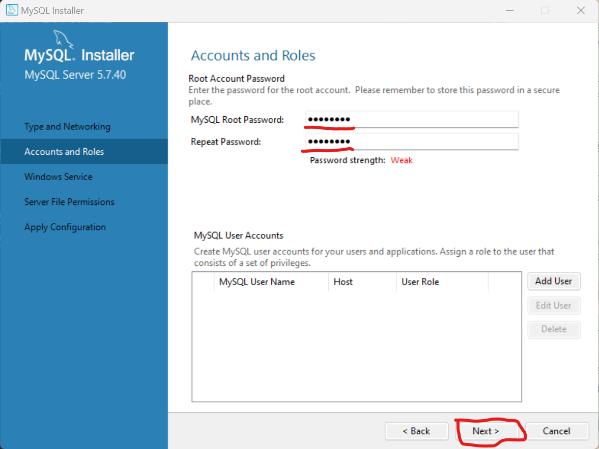
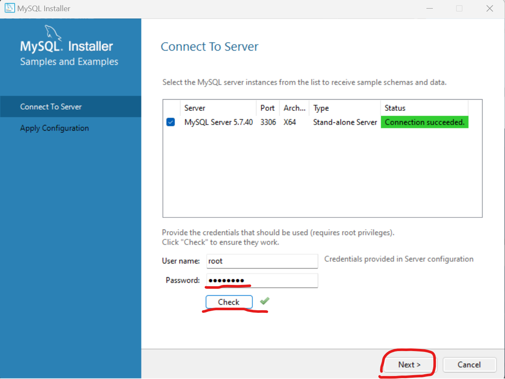

1. MySQL 설치
==
## 1.설치과정
- 다운로드 경로 : https://dev.mysql.com/downloads/windows/installer/5.7.html 

- 경로 접속 후 버전에 맞는 파일 다운로드
  

- 기본값 선택 후 Next
  

- 아래그림대로 진행
  
  

- 설치가 끝나면 next
  

- Configtype과 기본 포트 설정
  
  

- 비밀번호 설정
  

- 유저생성 후 next
  

- windows 서비스 설정(작업관리자에서 서비스부분영역에 생성된다.(실행이 되어있어야 DB가 정상작동이 된다.))
  
  

- 계속진행
  
  

- 설정했던 비밀번호 입력 후 check하고 next
  

- 계속진행
  
  
  

- 설치완료!

---

## 2.Workbench
- 설치 완료 후 workbench 셋팅하기(+버튼 클릭)
  

- 번호 순서대로 입력하기(2번,4번은 설치시 셋팅한 이름과비밀번호입력!)  
  

- Test Connection을 통해 정상연결확인하기
  

- 블로그 만들기- DB셋팅완료!
  
