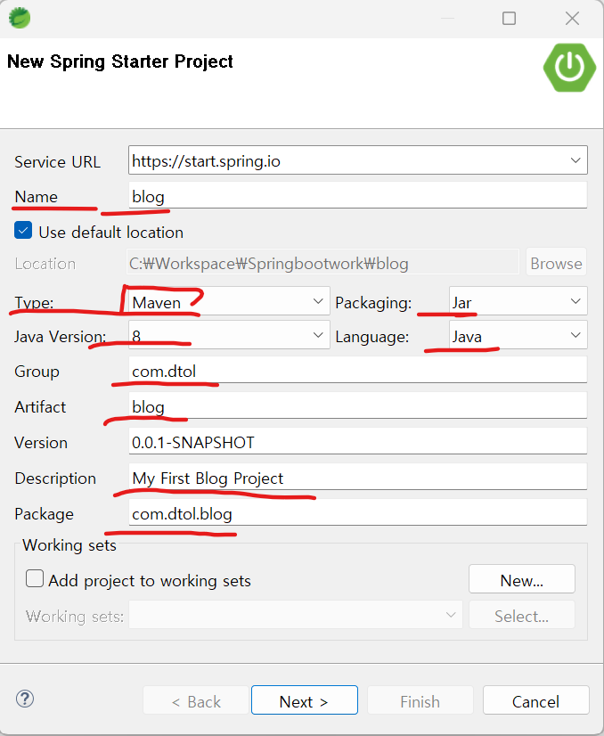
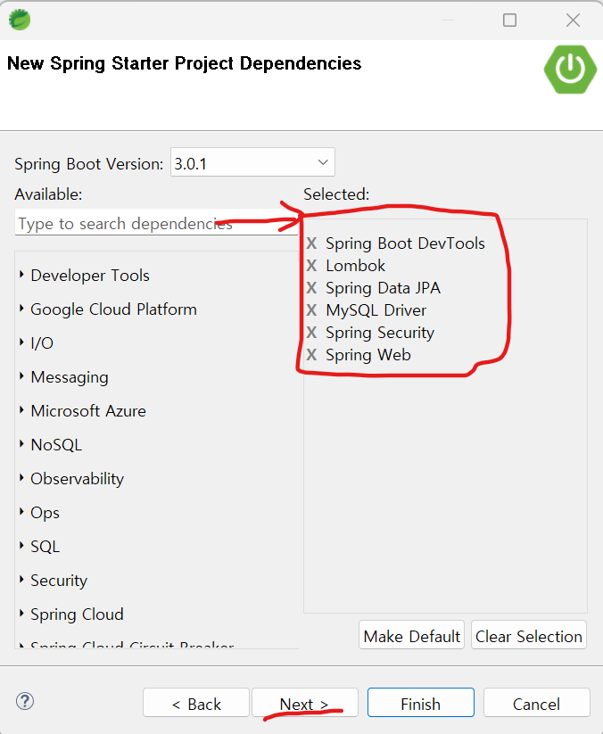
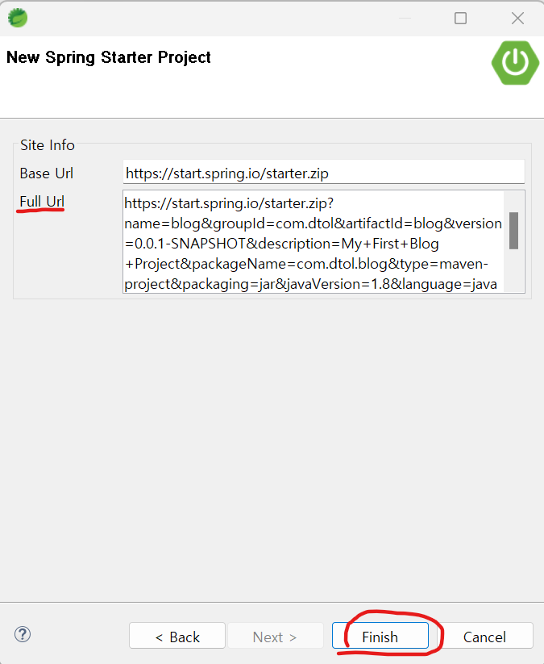
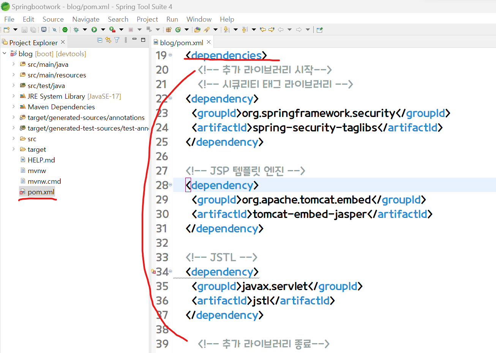

2. 의존성 설정
==
## 1. Spring Boot DevTools
### Spring Boot DevTools가 제공하는 기능은 크게 5가지
- Property Defaults
- Automatic Restart
- Live Reload
- Global Settings
- Remote Applications
1. Property Defaults
   - 개발 시점과 배포 시점에 다른 설정을 기본적으로 개발 단계에 맞춰 설정해준다. 
   - 예를 들어 템플릿 엔진의 캐싱 기능을 개발 단계에서 자동으로 꺼주는 역할을 한다.
   - 설정 파일을 건드리지 않아도 되는 장점이 있다.

2. Automatic Restart
   - Spring Boot DevTools는 이 기능을 자동으로 제공한다.
   - 파일 수정 후 저장을 하면, Classpath에 존재하는 파일의 변경을 감지하고, 자동으로 서버를 restart 해준다.

3. Live Reload
- Js파일을 수정하기만 해도 자동으로 브라우저가 새로 고침 되는 기능.

## 2. Lombok
  - Java의 라이브러리로 반복되는 메소드를 Annotation을 사용해서 자동으로 작성해주는 라이브러리다. 
  - 보통 DTO나 Model, Entity의 경우 여러 속성이 존재하고 이들이 가지는 프로퍼티에 대해서 Getter나 Setter, 생성자 등을 매번 작성해줘야 하는 경우가 많은데 이러한 부분을 자동으로 만들어주는 라이브러리라고 할 수 있다.

## 3. Spring Data JPA
- JPA(Java Persistence API) 자바 어플리케이션에서 관계형 데이터베이스를 사용하는 방식을 정의한 인터페이스이다.
- 
## 4. MySQL Driver
- MySQL사용을 위하여 Driver 설치
## 5. Spring Security
- Spring Security는 Spring 기반의 애플리케이션의 보안(인증과 권한, 인가 등)을 담당하는 스프링 하위 프레임워크.
## 6. 템플릿 엔진
   - jsp 사용
## 7. Spring Web
   - WEB MVC를 사용하여 웹 애플리케이션을 만드는데 필요한 스프링부트의 기본적인 요소를 가짐.
   - 내장형 컨테이너로 톰캣을 기본탑재하고 있다.

## 8.의존성 설정 과정
- 프로젝트 생성 후 기본적인 셋팅
   

- Available 에 검색하여 필요한 6개의 의존성을 위한 라이브러리 설치 
   
- Full Url에 설치한 6개의 라이브러리가 연결되어있다.
   

## 9. 추가적인 의존성 설정
- 프로젝트 pom.xml 부분에서 <dependencies>에 추가적으로 jsp 템플릿 엔진과 시큐리티 태그 라이브러리 JSTL을 추가해준다.
  

---
# 3. 프로젝트 실행
```java
package com.dtol.blog.test;

import org.springframework.web.bind.annotation.GetMapping;
import org.springframework.web.bind.annotation.RestController;

// 스프링이 com.cos.blog 패키지 이하를 스캔해서 모든 파일을 메모리에 new하는 것은 아니고,
//특정 어노테이션이 붙어있는 클래스 파일들을 new해서(IoC) 스프링 컨테이너에 관리해준다.
@RestController					
public class BlogControllerTest {
	
	//http://localhost:8080/test/hello
	@GetMapping("/test/hello")
	public String hello() {
		return "<h1>hello spring boot</h1>";  // 브라우저에 메세지가 나온다.
	}
}

```
- 
