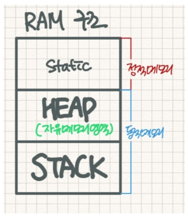
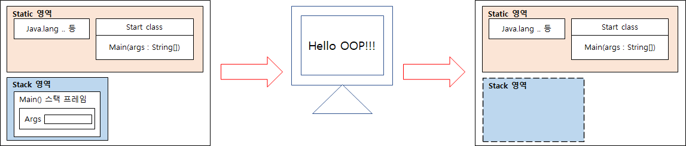

# __2장. 자바와 절차적/구조적 프로그래밍__

---

## __1) 메모리 데이터 영역__
### (1) 메모리 영역
- 프로그램에서 크게 두 가지 영역을 가지며 '코드 실행 영역'과 '데이터 저장 영역' 이다.
- 객체 지향 프로그램에선 3가지 영역으로 분할 된다. <br>

- 위와 같이 static 영역, HEAP 영역, stack 영역으로 나뉜다.

※ 각 영역별 설명 <br>
> (1) Static 영역 : main()이 start 될 때, static 예약어로 설정된 클래스 변수,<br/> 클래스 메소드가 자동 할당되는 공간이며 프로그램 종료시 자동 종료됨 <br>

> (2) HEAP 영역 : new 연산자에 의해 동적 할당하고 생성된 주소(위치정보)로 접근할 수 있는 공간 자바에서는 객체(인스턴스), 배열 공간은 모두 이 메모리 영역에 할당되도록 설정되어있음

> (3) Stack 영역 : non_static 메소드 실행시 메소드 호출 스택(method call stack)에 메소드 영역이 할당되며, 해당 메소드의 지역변수와 매개변수(parameter)가 영역 안에 할당됨. 메소드 리턴(종료)시 자동 소멸됨

<br>

---

## __2) 절차적/구조적 프로그래밍__
### (1) 함수와 메서드
- 함수와 메소드의 차이점은 함수는 클래스나 객체와 아무런 상관이 없지만 메서드는 반드시 클래스 정의 안에 존재해야 한다.
<br>

### (2) main() 메서드 : 메서드 스택 프레임
- main() 메서드는 프로그램 시작점으로 해당 메서드가 실행될 때 메모리에 변화를 순차적으로 알아보자. <br>
<br>

```java
public class Start{
    public static void main(STringp[] args){
        System.out.printIn("Hello OOP!!!");
    }
}
```
<br>

[1] JRE

- main() 메서드가 있는지 확인함
- Start 클래스에서 main() 메서드를 발견함
- 프로그램 실행을 위한 사전 준비에 착수함
- JVM 에 전원을 넣어 부팅함

[2] JVM

- 목적파일을 받아 실행함
- java.lang 패키지를 스태틱(static) 영역에 올려놓음(전처리 과정)
- 개발자가 작성한 모든 클래스와 임포트 패키지를 스태틱(static) 영역에 올려놓음(전처리 과정)
- 위 예제 코드에서는 start 라는 클래스 뿐이니 start 클래스만 스태틱(static) 영역으로 올려놓음
- 중괄호를 만날 때마다 스택(Stack) 영역내 스택 프레임이 하나씩 증가함. 단, class 정의 시작점 중괄호는 제외함
- 해당 스택 프레임 내에 메서드의 인자 args를 저장할 변수 공간을 확보함. 즉, 메서드 인자의 변수 공간을 할당함

[3] 이후 진행사항

- main() 메서드 스택 프레임 생성 이후 3번째 줄도 실행, 4번째 줄에서 main() 메서드의 끝을 나타내는 닫는 중괄호와 만남
- 여는 중괄호로 스택 프레임이 만들어지고 닫는 중괄호로 스택 프레임이 소멸됨
- 결국 main() 메서드는 프로그램의 시작이자 끝이기도 함
- main() 메서드가 끝나면 JAR, JVM 을 종료하고 JRE 자체도 운영체제 상의 메모리에서 사라짐

---

#### [진행 프로세스]
 <br>

- 위와 같이 'System.out.printIn()' 실행이후 스택(Stack) 영역에 생성되었던 main() 스택 프레임은 없어짐

---

## __3) 변수와 메모리__ <br>


```java
public class Start2{
    public static void main(String[] args){
        int i;
        i = 10;
        double d = 20.0;
    }
} // 7번째 줄
```

- 위 코드에서 이전 순서대로 진행하면 'int i;' 부분은 main() 메서드 스택 프레임 내에 i 라는 변수 공간이 생김
- 앞서 메모리 구역을 설명할 떄와 마찬가지로 변수는 main() 스택 프레임이 생성되고 난 이후 변수 공간을 계속 확보하게 됨
- 처음 변수 공간을 할당하고 난 후에는 해당 공간엔 값을 알 수 없음
- 'i = 10;' 행에서 i 변수 공간에 '10' 이라는 정수 값이 입력됨
- 마지막으로 'double d = 20.0;' 이 실행되면서 d 변수 공간이 생김과 동시에 '20.0' 이라는 실수 값이 적용되게 됨
- 여기서 i 변수와 다르게 d 변수 는 두가지 명령을 동시에 수행함
- d 변수 공간을 만들고 값을 넣는다 라는 액션을 하게 됨
- 7번째 줄의 닫기 중괄호의 main() 메서드 스택 프레임이 스택 영역에서 사라지고 프로그램이 종료된다.


