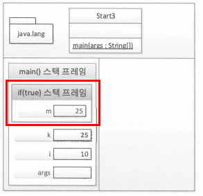

# __2장. 자바와 절차적/구조적 프로그래밍__

---

## __1) 메모리 데이터 영역__
### (1) 메모리 영역
- 프로그램에서 크게 두 가지 영역을 가지며 '코드 실행 영역'과 '데이터 저장 영역' 이다.
- 객체 지향 프로그램에선 3가지 영역으로 분할 된다. <br>

- 위와 같이 static 영역, HEAP 영역, stack 영역으로 나뉜다.

※ 각 영역별 설명 <br>
> (1) Static 영역 : main()이 start 될 때, static 예약어로 설정된 클래스 변수,<br/> 클래스 메소드가 자동 할당되는 공간이며 프로그램 종료시 자동 종료됨 <br>

> (2) HEAP 영역 : new 연산자에 의해 동적 할당하고 생성된 주소(위치정보)로 접근할 수 있는 공간 자바에서는 객체(인스턴스), 배열 공간은 모두 이 메모리 영역에 할당되도록 설정되어있음

> (3) Stack 영역 : non_static 메소드 실행시 메소드 호출 스택(method call stack)에 메소드 영역이 할당되며, 해당 메소드의 지역변수와 매개변수(parameter)가 영역 안에 할당됨. 메소드 리턴(종료)시 자동 소멸됨

<br>

---

## __2) 절차적/구조적 프로그래밍__
### (1) 함수와 메서드
- 함수와 메소드의 차이점은 함수는 클래스나 객체와 아무런 상관이 없지만 메서드는 반드시 클래스 정의 안에 존재해야 한다.
<br>

### (2) main() 메서드 : 메서드 스택 프레임
- main() 메서드는 프로그램 시작점으로 해당 메서드가 실행될 때 메모리에 변화를 순차적으로 알아보자. <br>
<br>

```java
public class Start{
    public static void main(STringp[] args){
        System.out.printIn("Hello OOP!!!");
    }
}
```
<br>

[1] JRE

- main() 메서드가 있는지 확인함
- Start 클래스에서 main() 메서드를 발견함
- 프로그램 실행을 위한 사전 준비에 착수함
- JVM 에 전원을 넣어 부팅함

[2] JVM

- 목적파일을 받아 실행함
- java.lang 패키지를 스태틱(static) 영역에 올려놓음(전처리 과정)
- 개발자가 작성한 모든 클래스와 임포트 패키지를 스태틱(static) 영역에 올려놓음(전처리 과정)
- 위 예제 코드에서는 start 라는 클래스 뿐이니 start 클래스만 스태틱(static) 영역으로 올려놓음
- 중괄호를 만날 때마다 스택(Stack) 영역내 스택 프레임이 하나씩 증가함. 단, class 정의 시작점 중괄호는 제외함
- 해당 스택 프레임 내에 메서드의 인자 args를 저장할 변수 공간을 확보함. 즉, 메서드 인자의 변수 공간을 할당함

[3] 이후 진행사항

- main() 메서드 스택 프레임 생성 이후 3번째 줄도 실행, 4번째 줄에서 main() 메서드의 끝을 나타내는 닫는 중괄호와 만남
- 여는 중괄호로 스택 프레임이 만들어지고 닫는 중괄호로 스택 프레임이 소멸됨
- 결국 main() 메서드는 프로그램의 시작이자 끝이기도 함
- main() 메서드가 끝나면 JAR, JVM 을 종료하고 JRE 자체도 운영체제 상의 메모리에서 사라짐

---

#### [진행 프로세스]
 <br>

- 위와 같이 'System.out.printIn()' 실행이후 스택(Stack) 영역에 생성되었던 main() 스택 프레임은 없어짐

---

### (3) 변수와 메모리
```java
public class Start2{
    public static void main(String[] args){
        int i;
        i = 10;
        double d = 20.0;
    }
} // 7번째 줄
```

- 위 코드에서 이전 순서대로 진행하면 'int i;' 부분은 main() 메서드 스택 프레임 내에 i 라는 변수 공간이 생김
- 앞서 메모리 구역을 설명할 떄와 마찬가지로 변수는 main() 스택 프레임이 생성되고 난 이후 변수 공간을 계속 확보하게 됨
- 처음 변수 공간을 할당하고 난 후에는 해당 공간엔 값을 알 수 없음
- 'i = 10;' 행에서 i 변수 공간에 '10' 이라는 정수 값이 입력됨
- 마지막으로 'double d = 20.0;' 이 실행되면서 d 변수 공간이 생김과 동시에 '20.0' 이라는 실수 값이 적용되게 됨
- 여기서 i 변수와 다르게 d 변수 는 두가지 명령을 동시에 수행함
- d 변수 공간을 만들고 값을 넣는다 라는 액션을 하게 됨
- 7번째 줄의 닫기 중괄호의 main() 메서드 스택 프레임이 스택 영역에서 사라지고 프로그램이 종료된다.

---

### (4) 블록 구문과 메모리 : 블록 스택 프레임
```java
public class Start3{
    public static void main(String[] args){
        int i = 10;
        int k = 20;

        if ( i == 10 ){
            int m = k + 5;
            k = m
        } else {
            int p = k + 10
            k = p;
        }

        // k = m + p;
    }
}
```
- 변수 i 와 k 은 위에 언급한 변수와 메모리 방식처럼 적용된다.
- 문제는 if 문(블록)을 만나면서 시작이 된다.
- if 문은 조건에 따라 다른 공간이 발생되기 때문이다.
- 현재 위 코드에서는 i 변수에 저장된 값이 '10' 이냐 는 질문의 답은 True 이다.
- 그러면 if ~ else 블록 중 true에 해당하는 블록이 실행됨
- 이때 main() 스택 프레임 안에 if(true) 스택 프레임이 생성이됨
- if(true) 스택 프레임 안에서도 'int m = k + 5' 구문이 발생함
- 그러면 m 이라는 신규 변수는 main() 스택 프레임 안에 if(true) 스택 프레임 안에 변수 공간이 생성이 되게 됨
- 여기서 중요한 점은 'int m = k + 5' 구문에서 k 변수는 main() 스택 프레임 안에 있는 변수 공간 값임으로 해당 변수 공간에 입력된 값인 '20'을 가져다가 계산하는 데에 사용함
- 그럼 m 변수 공간 값엔 '25' 라는 값이 입력됩니다. 또한 여기서 'k = m' 이라는 구문도 있기 때문에 결국 'k = 25'가 됩니다. <br>

- 여기서 'k = 25' 라는건 if(true) 스택 프레임 안에서만 사용하는 것이 아니라 main() 스택 프레임 내 k 변수 공간에 해당 값이 덮어씌이게 된다.
- 끝으로 if(true) 스택 프레임 종료에 해당하는 if문 닫힌 중괄호를 만나면 if(true) 스택 프레임도 같이 종료된다(사라진다) 

---
### (5) 지역변수와 메모리
- 지역 변수는 스택 영역에서만 존재함. 더 정확하게는 스택 프레임 내에서만 존재하게 됨
- 클래스 멤버 변수는 스태틱(static) 영역에서 계속 있으며 한번 자리를 잡으면 JVM이 종료될 때까지 고정된(static) 상태가 됨
- 객체 멤버 변수는 힙(heap) 영역에 있으며 가비지 컬렉터라고 하는 힙 메모리 회수기에 의해 종료됨
- 지역변수에 대한 메모리 영역에 대해 알아보면 다음과 같습니다.
```java
public class Start3{
    public static void main(String[] args){
        int i = 10;
        int k = 20;

        if( i == 10 ){
            int m = k + 5 ;
            k = m;
        } else {
            int p = k + 10;
            k = p;
        }
    
        // k = m + p  // 해당 부분을 주석처리는 지역 변수와 전역 변수 차이로 인함이다.
    }
}
```
- 위 코드는 블록 구문에서 보았던 예제임, 여기서 if 문 안에서 사용되는 'k + 5' 부분에서 k 는 외부에서 가져온 k 변수 값이다.
- 이는 메모리상에 k 변수 공간 값이 존재하기 때문임
- 여기서 중요한 사실은 외부 스택 프레임 내 변수 공간 값은 내부 스택 프레임(if 스택 프레임)에 사용될 수 있다 라는 것
- 반대로는 가능하지 않다. 예를 들어, if 문 안에 생성된 변수는 즉 지금처럼 m 변수는 if 문 안에서 사용된 변수이다. 이 변수는 외부 main() 스택 프레임에 사용될 수 없다. 해당 변수는 if 문 스택 프레임이 종료되는 시점에 사라지기 때문이다.

---
### (6) 메서드 호출과 메모리 : 메서드 스택 프레임
```java
public class Start4{
    public static void main(String[] args){
        int k = 5;
        int m;

        m = square(k);
    }

    private static int square(int k){
        int result;
        k = 25;
        
        result = k;

        return result;
    }
}
```
- 여기에서는 2가지 메서드를 호출하게 됨, main() 과 square()
- 우선 main() 에서 생성된 변수 2개(k, m)가 해당 메서드 스택 프레임에 공간이 생성된 상태
- 위 코드에서 각자의 메서드 스택 프레임은 각자 사용하는 지역 변수간 접근이 불가능함 
- 영역에 존재하는 메서드의 특징을 가진다.
<br>
[1] 메서드는 서로의 고유 공간, 무단 침입은 허용하지 않음 <br>
[2] 특정 메서드에서 다른 메서드의 변수를 사용하려면 해당 변수에 대한 메모리 주소값을 알고 있어야 됨 <br>
[3] 메서드는 다양한 곳으로 부터 호출 될 수 있다. <br>
[4] 메서드를 호출하면서 인자로 전달되는 것은 변수가 자체가 아니라 변수가 저장한 값만 복제됨(call by value) <br>
[5] 메서드 사이에 값을 전달하거나 반환하는 방법은 메거드의 인자와 반환값으로만 가능하다. (가급적으로 전역변수는 잘 사용하지 않는 것이 좋다.)

---
### (7) 멀티 스레드 / 멀티 프로세스
- 멀티 스레드는(Muti Thread)는 스택 영역을 스레드 개수 만큼 분할해서 사용하는 것

- 멀티 프로세스(Muti Process)는 다수의 데이터 저장 영역 자체를 가지는 것


> 차이점 <br>
- 멀티 스레드는 하나의 메모리만 사용하는데 스택 영역만 분할해서 사용함
- 멀티 스레드는 하나의 메모리 공간안에 스택 영약만 구분하기에 다른 스레드의 영역으로 접근이 불가함, 그렇지만 메모리 사용량이 적게듬
- 멀티 프로세스는 프로세스 마다 메모리 공간이 고유하게 존재함으로 서로 참조가 안됨
- 멀티 프로세스는 서로 참조가 불가능해 안전한 구조이지만 메모리 용량이 커짐
