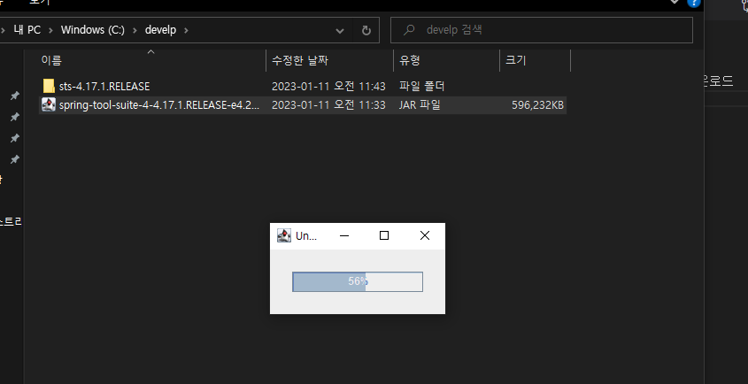
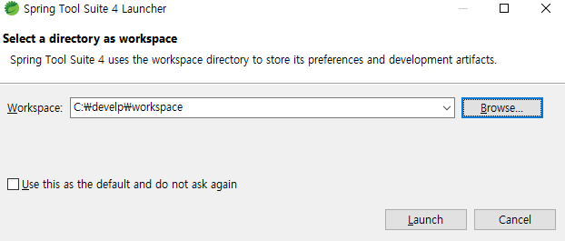
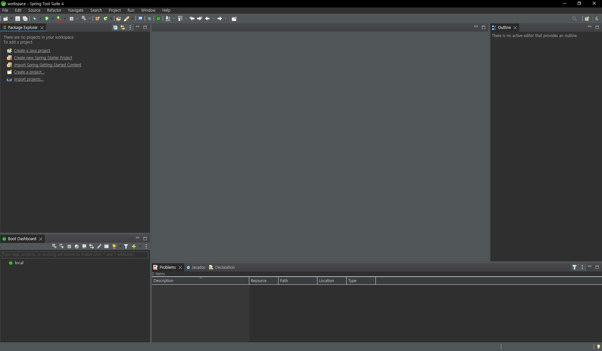
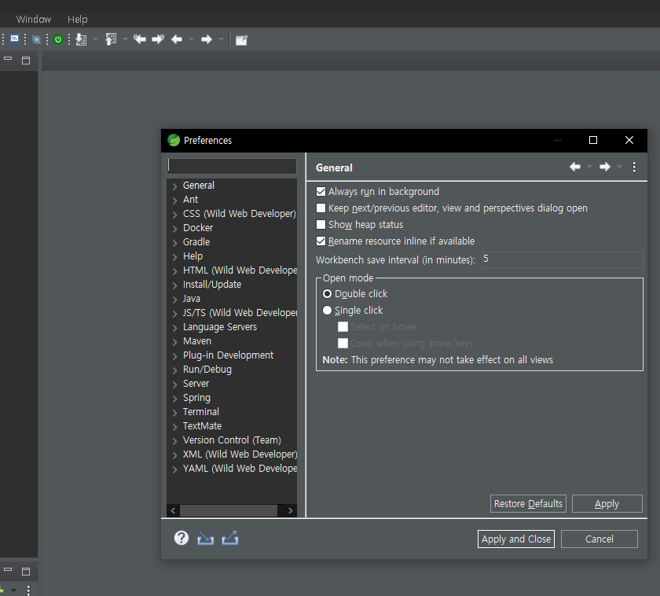
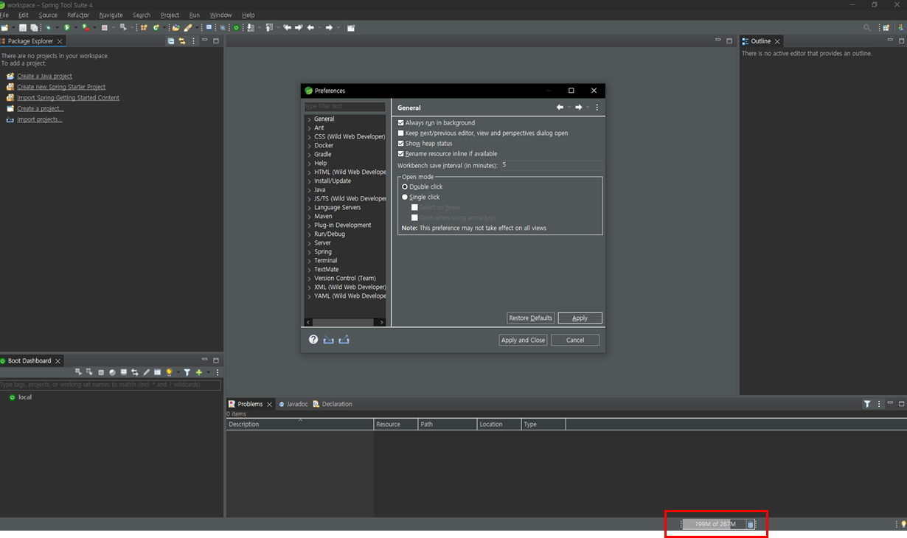
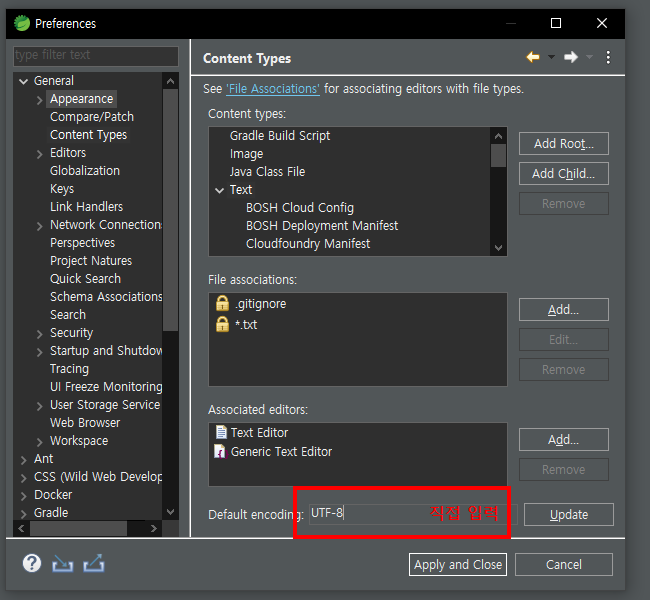
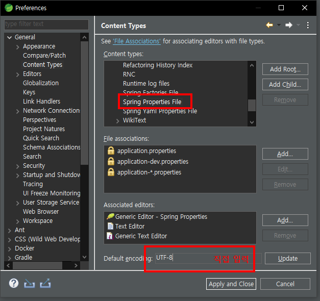
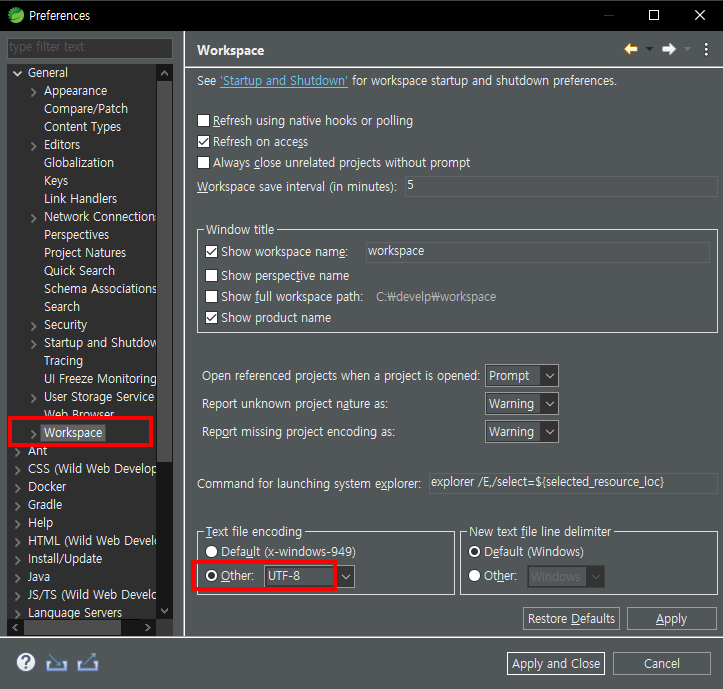

# STS(Spring Tools Suite) 설치
## 1. 설치 순서 
- [STS 공식 홈페이지](https://spring.io/tools), 운영체제에 맞게 설치파일 다운로드
- 설치 파일을 더블 클릭 하여 파일을 풀어줌  

 

- 압축 해제된 폴더 내에 'SpringToolSuite4.exe'를 실행함, 'workspace' 는 develp 폴더 내로 설정하였음  
 

- Spring Tools Suite 정상 실행 화면을 확인함 

## 2. 기본 설정 방법
### 1) Show heap status
- STS 프로그램 상단 메뉴 중 'Windows > Pregerences' 를 선택함

- 해당 'Pregrecnso' 메뉴 좌측 'General' 을 선택함
- 'General' 부분에서 'Show heap status' 부분을 체크함, (heap의 크기 상태를 보여줌)

- 위 스크린샷 처럼 아래 'heap' 상태가 표시되며 sts가 버덕이면 휴지통 버튼을 눌러주면 된다.

### 2) UTF-8 인코딩 변경
- STS 프로그램 상단 메뉴 중 'Windows > Pregerences' 를 선택함
- 'Pregerences' 좌측 메뉴 'General' 화살표를 선택함
- 'Content Type' 선택 후 중앙 화면에서 'Text' 선택
- 'Default encoding: UTF-8' 입력 후 'Update'

- 'Content Type' 중앙 화면에서 'Spring Properties File' 선택
- 'Default encoding: UTF-8' 입력 후 'Update'

- 'General > Workspace' 선택 후 하단 'Text file encoding' 부분도 'Other'을 'UTF-8' 로 변경

- 위와 같이 'UTF-8' 로 수정 처리 하여야 한글 깨짐을 방지할 수 있다.

---
> 기본적인 설치 및 세팅이 완료되었다.