2장 : 자바와 절차적/구조적 프로그래밍
==
## 1.자바 프로그램의 개발과 구동
### 1)자바 프로그램 구동 방식(Write Once Run Anywhere)
 &nbsp;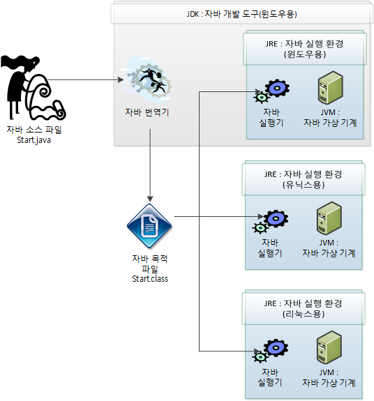

|현실 세계| 가상 세계(자바)|
|------|---|
|소프트웨어 개발 도구|JDK(Java Development Kit, 자바 개발 도구)|
|운영체제 |JRE(Java Runtime Environment, 자바 실행 환경)|
|하드웨어(물리적 컴퓨터)|JVM(Java Virtual Machine, 자바 가상 기계)|

- 현실 세계에서 소프트웨어는 개발자가 개발 도구를 이용해 개발하고 운영체제를 통해 물리적 컴퓨터인 하드웨어 상에서 구동된다.
- 자바의 가상 세계도 이와 비슷하다. 자바 개발 도구인 JDK를 이용해 개발된 프로그램은 JRE에 의해 가상의 컴퓨터인 JVM 상에서 구동된다.
  - 배포되는 JDK는 JRE를 포함하고, JRE는 JVM을 포함하는 형태로 배포된다.
  - JDK는 자바 소스 컴파일러인 javac.exe를 포함하며, JRE는 자바 프로그램 실행기인 java.exe를 포함한다.
<br><br>
### 2)프로그램이 메모리를 사용하는 방식
 &nbsp;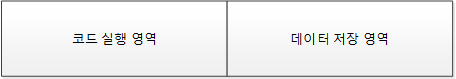
- 기계어를 포함한 모든 프로그래밍 언어의 공통된 메모리 사용방식

### 3)객체 지향 프로그램의 메모리 사용 방식
 &nbsp;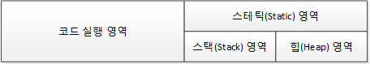
- 데이터 저장 영역은 삼분할로 되어있어 T메모리 구조라고 지칭한다.

### 3-1)Main() 메서드: 메서드 스택 프레임
- main() 메서드는 프로그램이 실행되는 시작점
1. main() 메서드 실행 전 과정
   - JRE는 메인 메서드를 찾는다.
   - 메인 메서드의 존재가 확인되면 JVM을 구동시킨다.
   - JVM은 메인 메소드를 실행한다.

2. main() 메서드가 실행되기 전 JVM에서 수행하는 전처리 작업들
   - java.lang 패키지를 T 메모르의 스태틱 영역에 배치한다.
   - import된 패키지를 T 메모리의 스태틱 영역에 배치한다.
   - 프로그램 상의 모든 클래스를 T 메모리의 스태틱 영역에 배치한다.
   - 즉, 메인 메서드가 실행되기 전에 스태틱 영역에 필요한 패키지와 클래스의 정보가 올라간다.
   - 아래 그림참조

&nbsp;&nbsp;&nbsp;&nbsp;&nbsp;&nbsp;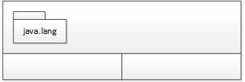
&nbsp;&nbsp;&nbsp;&nbsp;&nbsp;&nbsp;
### 스태틱 영역(클래스의 놀이터)
- java.lang, import된 패키지, 사용하는 클래스가 배치되는 영역이다.
- 클래스 내부에 static으로 선언되어있는 전역 변수들은 해당 클래스가 스태틱 영역의 공간에 배치될 때 그 안에 클래스의 멤버로 공간을 만들어 저장된다.

### 스택 영역(메서드의 놀이터)
- 스택 프레임이 생성되는 영역이다.
- 스택 메모리 내의 스택 프레임 안의 변수는 지역 변수라고 하며, 해당 프레임에서만 사용할 수 있고 외부에서는 사용할 수 없다. (스택 영역에 있는 각 스택 프레임에서도 접근이 불가능)

지역 변수 접근 불가 이유
1. 메서드는 고유 공간이라서 서로 침범할 수 없는게 이치에 맞기 때문
2. 포인터 문제. 
   - ex> A 스택 프레임에서 B 스택 프레임 내부의 지역 변수에 접근하려면, 해당 지역 변수의 위치를 명확히 알아야 하는데, 자바에서는 포인터가 존재하지 않기 때문에 접근이 불가능하다.
3. 메서드는 다양한 곳에서 호출되기 때문
   - 만약 호출한 메서드 내부의 지역 변수를 호출당하는 메서드에서 제어할 수 있게 하려면 포인터를 주고 받아야 하고, 이는 두 번째 문제와 연결된다. 
   - 메서드를 호출하면서 만들어지는 스택 구조도 항시 변화할 것이다. 따라서, 어느 메서드 스택 프레임의 변수를 참조해야하는지에 대한 문제가 발생한다.

**Call by value?**
- 메서드호출 방식중 하나
- 전달되는 변수의 값을 복사하여 함수의 인자로 전달하는 것을 의미

### 힙 영역(객체의 놀이터)
- 힙 영역은 객체가 배치되는 공간이다.
- 힙은 대용량 자료를 저장할 수 있도록 메모리를 사용하는 자료구조이다.

**Call by reference?**
- 메서드 호출 방식중 하나이다.
- 전달되는 변수의 주소를 전달한다.
---
## 2-1. main() 메서드가 실행될 때 메모리의 변화
```java
public class Start {
	public static void main(String[] args) {
		System.out.println("Hello OOP!!!"); // 3번째 줄
	}
}
```
 &nbsp;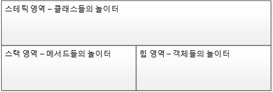

1) main() 메서드 스택 프레임
- 스택 프레임이 스택 영역에 할당된다.
- 중괄호를 만날 때마다 스택 프레임이 하나씩 생긴다(단, 클래스 정의를 시작하는 중괄호는 제외)
- 아래 그림참조
  
 &nbsp;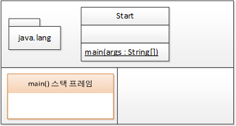  
 &nbsp;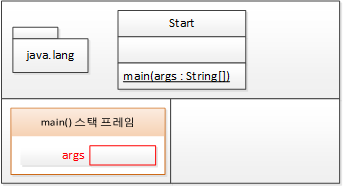
 - 메서드의 인자의 변수 공간을 할당해야한다.

 &nbsp;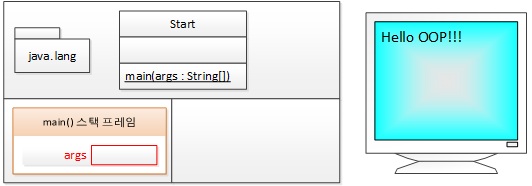
  -  System.out.println(("Hello OOP!!!); 실행 후 T 메모리 영역)
  - 명령문 실행(Hello OOP!!! 출력)
  
 &nbsp;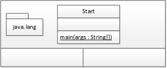
- main() 메서드 종료 이후의 T메모리 상태(스택 프레임이 소멸된다.)

### Debug를 이용한 T메모리 스택 영역의 상태확인
 &nbsp;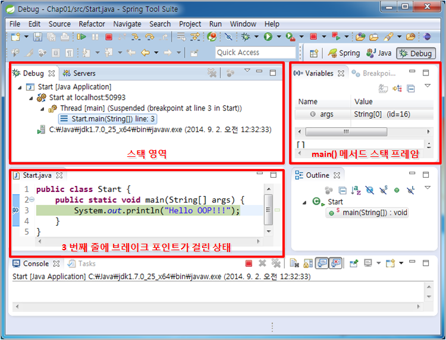
- 3번쨰 줄에 브레이크 포인트를 설정.
- Run -> Debug를 실행 했을 때의 Debug 퍼스펙티브를 확인.
- 상단 좌측은 스택영역을 유추해 볼 수 있다.
- 상단 우측에서 main() 메서드 스택 프레임 내부의 지역 변수를 확인할 수 있다.


## 2-2.main() 메서드가 실행될 때 메모리의 변화
- main() 메서드 구문에 변수 할당하는 부분을 추가

```java
public class Start2 {
	public static void main(String[] args) {
		int i; //3번째 줄
		i = 10;

		double d = 20.0;
	}
}
```
- JRE가 JVM을 구동시키고 JVM이 전처리 하는 과정 및 전처리 이후 main() 메서드를 수행하기 위해 스택 영역에 main() 메서드용 스택 프레임 및 파라미터를 위한 변수 공간 할당하는 것은 예제 1과 동일

 &nbsp; &nbsp; &nbsp; &nbsp;

- [그림 설명] JVM 구동 및 전처리 과정 후 스택 영역에 main() 메서드를 위한 스택 프레임 생성

- 코드의 3번째 줄에 존재하는 int i; 명령을 수행하는 부분부터 과정이 달라진다. 먼저 이 명령어는 4바이트짜리 정수 저장 공간을 main() 스택 프레임안에 만들어라 라고 해석할 수 있다.
    - 스택 프레임 안에 변수 공간은 아래에서부터 만들어지며, 처음에는 어떤 값을 줄지 모르기 때문에 (?)을 가지게 된다.
    - 이때 생성된 변수는 스택 프레임 안에서 사용되는 변수로 **지역변수**라고 한다.


 &nbsp; &nbsp; &nbsp; &nbsp; &nbsp; &nbsp; &nbsp; &nbsp; &nbsp; &nbsp;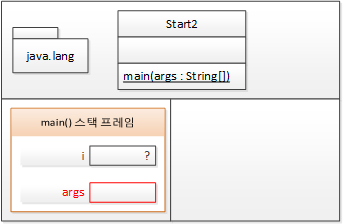

 &nbsp; &nbsp; &nbsp; &nbsp; &nbsp; &nbsp; &nbsp; &nbsp; &nbsp; &nbsp; &nbsp; &nbsp; &nbsp; &nbsp; &nbsp; &nbsp; &nbsp; &nbsp; &nbsp; &nbsp; &nbsp; &nbsp; &nbsp;- 변수 (i) 공간

 - 그 다음 라인에서 i =10; 명령어를 수행함으로써 i라는 변수 공간을 10으로 초기화하게 된다.
  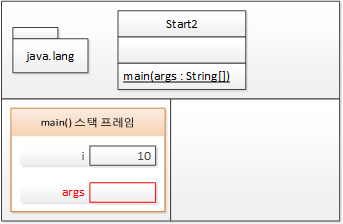
   
    &nbsp; &nbsp; &nbsp; &nbsp; &nbsp; &nbsp; &nbsp; &nbsp; &nbsp; &nbsp; &nbsp; &nbsp; &nbsp; &nbsp;&nbsp;- 변수(i)에 값 할당

- 나머지 과정은 예제 1과 동일하게 중괄호(})를 만나 스택 프레임 제거 및 프로그램 종료가 진행된다.
---

## 2-3. main() 메서드가 실행될 때 메모리의 변화
- main() 메서드 내에 중괄호({})가 추가로 있는 블록 구문이 존재할 때의 T 메모리 구조
```java
public class Start3 {
	public static void main(String[] args) {
		int i = 10;
		int k = 20; // 4번째 줄

		if(i == 10) { // 6번째 줄
			int m = k + 5;
			k = m;
		} else {
			int p = k + 10;
			k = p;
		}

		//k = m + p;
	}
}
```
- 위 코드의 4번째 줄이 완료되었을 때의  T메모리 구조(아래그림)

&nbsp;&nbsp;&nbsp;&nbsp;&nbsp;&nbsp;&nbsp;&nbsp;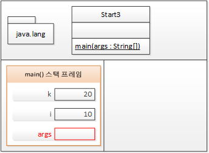
 
 &nbsp;&nbsp;&nbsp;&nbsp;&nbsp;&nbsp;&nbsp;&nbsp; &nbsp;&nbsp;&nbsp;&nbsp;- 변수(i, k)가 할당된 main() 메서드의 스택 프레임

  - 6번째 중에 if문을 여는 중괄호({)가 있기 때문에 새로운 스택 프레임이 시작된다.
    - 이때 시작되는 스택 프레임은 i==10이 참이므로 fi(true) 스택 프레임이 생성된다고 볼 수 있다.
    - main() 메서드 내에서 생성된 것이기 때문에 main() 스택 프레임 내 if(true) 스택 프레임이 생성된다.
    - if문이 true였기 때문에, else 구문은 스택 메모리에 등장 하지 않는다.
  
&nbsp;&nbsp;&nbsp;&nbsp;&nbsp;&nbsp;&nbsp;&nbsp;&nbsp;&nbsp;&nbsp;&nbsp;&nbsp;&nbsp;&nbsp;&nbsp;&nbsp;&nbsp;&nbsp;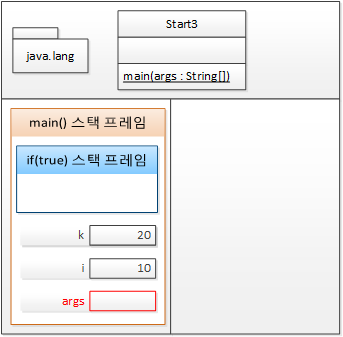

&nbsp;&nbsp;&nbsp;&nbsp;&nbsp;&nbsp;&nbsp;&nbsp;&nbsp;&nbsp;&nbsp;&nbsp;&nbsp;&nbsp;&nbsp;&nbsp;&nbsp;&nbsp;&nbsp;&nbsp;&nbsp;&nbsp;- if(true) 스택 프레임이 생성된 main() 스택 프레임

- if(true) 절의 명령어를 보면, 먼저 int m = k+5;라는 명령어를 마주하게 된다. 
- 이 명령어는 두가지 명령어를 합친 것으로 m이라는 이름의 4바이트 정수 변수를 선언(1)하고, 해당 변수에 k+5라는 값을 넣어 초기화(2)해주는 것이다.

&nbsp;&nbsp;&nbsp;&nbsp;&nbsp;&nbsp;&nbsp;&nbsp;&nbsp;&nbsp;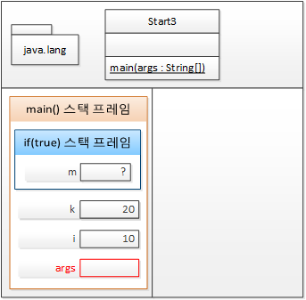 &nbsp;&nbsp;&nbsp;&nbsp;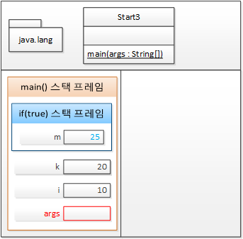

&nbsp;&nbsp;&nbsp;&nbsp;&nbsp;&nbsp;&nbsp;&nbsp;&nbsp;&nbsp;&nbsp;&nbsp;&nbsp;&nbsp;&nbsp;&nbsp;&nbsp;&nbsp;&nbsp;&nbsp;&nbsp;&nbsp;&nbsp;&nbsp;&nbsp;&nbsp;&nbsp;&nbsp;&nbsp;&nbsp;&nbsp;&nbsp;&nbsp;&nbsp;&nbsp;&nbsp;&nbsp;&nbsp;&nbsp;&nbsp;&nbsp;&nbsp;&nbsp;&nbsp;&nbsp;&nbsp;&nbsp;&nbsp;&nbsp;&nbsp;&nbsp;- if(true) 절 내 int m = K+5;실행(왼쪽은 (1), 오른쪽은 (2))
- 다음 명령어로 k = m;을 실행해서 if(true) 스택 프레임 밖에 있는 main()
 스택 프레임 내 변수인 k의 값을 변경해주며, 나머지는 이전 예제들과 동일하다.

&nbsp;&nbsp;&nbsp;&nbsp;&nbsp;&nbsp;&nbsp;&nbsp;&nbsp;&nbsp;&nbsp;

&nbsp;&nbsp;&nbsp;&nbsp;&nbsp;&nbsp;&nbsp;&nbsp;- if(true) 절 바깥의 main()
 스택 프레임에 존재하는 변수 값 변경

### **알수 있었던 점** : 외부 스택 프레임에서 내부 스택 프레임의 변수에 접근하는 것은 불가능하나 반대로는 가능하다.

---
## 2-4. main() 메서드가 실행될 때 메모리의 변화
- 반환값이 존재하는 메서드가 스택 프레임에 생성될 때 어떻게 생성되는지 확인하기
```java
public class Start4 {
	public static void main(String[] args) {
		int k = 5;
		int m;  // 4번째 줄

		m = square(k); // 6번째 줄
	}

	private static int square(int k) {
		int result;
		
		k = 25; // 12번째 줄

		result = k; // 14번째 줄

		return result;
	}
}

```
- 처음 실행은 예제별로 동일
- 이후, main()메서드를 수행하기 위해 main() 메서드용 스택 프레임을 스택 영역에 생성하게 되고, 4번째 줄까지 실행함으로써 main() 스택 프레임 내 k 변수를 초기화하고 m 변수 공간을 생성
  
&nbsp;&nbsp;&nbsp;&nbsp;&nbsp;&nbsp;&nbsp;&nbsp;&nbsp;&nbsp;&nbsp;&nbsp;&nbsp;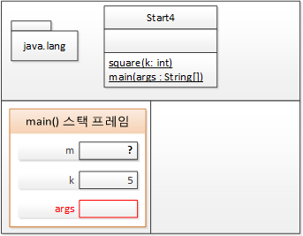

&nbsp;&nbsp;&nbsp;&nbsp;&nbsp;&nbsp;&nbsp;&nbsp;&nbsp;&nbsp;&nbsp;&nbsp;&nbsp;&nbsp;&nbsp;&nbsp;&nbsp;&nbsp;&nbsp;&nbsp;- main() 메서드의 int m;까지 실행한 상태
- 6번째 줄에서는 m = square(k); 명령어를 실행하여 square() 메서드를 스택 영역에 올린다.
    - square() 메서드의 경우 파라미터도 존재하고, 반환값도 존재한다.
    - 이 때, 반환값을 저장할 변수 공간 맨 아래에 두고 파라미터를 저장할 변수 공간을 둔 뒤 마지막으로 메소드의 지역 변수용 공간이 생긴다.

&nbsp;&nbsp;&nbsp;&nbsp;&nbsp;&nbsp;&nbsp;&nbsp;&nbsp;&nbsp;&nbsp;&nbsp;&nbsp;&nbsp;&nbsp;&nbsp;&nbsp;&nbsp;&nbsp;&nbsp;&nbsp;&nbsp;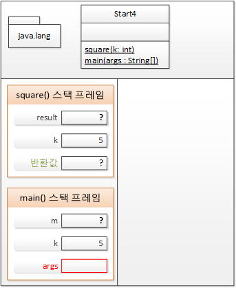

&nbsp;&nbsp;&nbsp;&nbsp;&nbsp;&nbsp;&nbsp;&nbsp;&nbsp;&nbsp;&nbsp;&nbsp;&nbsp;&nbsp;-square() 스택 프레임의 변수 공간 생성 순서(반환값 - 파라미터 - 지역변수)
- square() 메서드를 스택 영역에 올린 후 12번째 줄을 실행하면 square() 스택 프레임 속 k 변수(파라미터)의 값이 25로 변경 된다. 이 때, main() 스택 프레임의 k 변수는 값의 변화가 없다.
    - 이는, 이전에 main() 메서드 내에서 if 블록을 실행했을 때와 달리 square()와 main()의 스택 프레임이 각각 다른 영역에 생겨 각 스택 프레임 내 k 변수가 별도의 변수 공간이기 때문이다. 
    <br><br>

    &nbsp;&nbsp;&nbsp;&nbsp;&nbsp;&nbsp;&nbsp;&nbsp;&nbsp;&nbsp;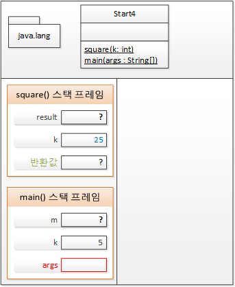

    &nbsp;&nbsp;&nbsp;&nbsp;&nbsp;&nbsp;&nbsp;&nbsp;&nbsp;&nbsp;&nbsp;&nbsp;- square 메서드와 main 메서드 속 변수 k는 다른 변수
- 13~14번째 줄을 통해 square() 스택 프레임의 k 값이 result 변수에 저장 후 반환되어 main() 스택 프레임의 변수 m이 초기화된다.

&nbsp;&nbsp;&nbsp;&nbsp;&nbsp;&nbsp;&nbsp;&nbsp;&nbsp;&nbsp;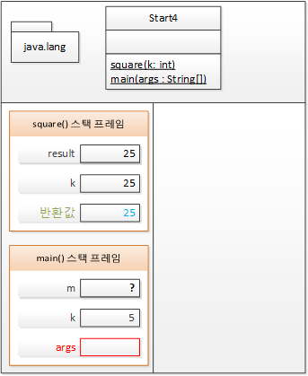 &nbsp;&nbsp;

&nbsp;&nbsp;&nbsp;&nbsp;&nbsp;&nbsp;&nbsp;&nbsp;&nbsp;&nbsp;&nbsp;&nbsp;&nbsp; - square() 메서드의 result 값이 25가 되고, 해당 값이 반환되어 main() 스택 프레임의 변수 m이 25가된다.

- 이후 과정은 다른 예제와 동일

---
## 3. T 메모리 구조를 활용하여 멀티 쓰레드와 멀티 프로세스 이해

### 프로세스(Process)란?
- 단순히 실행중인 프로그램(program)
- 사용자가 작성한 프로그램이 운영체제에 의해 메모리 공간을 할당받아 실행 중인 것을 말한다.
- 프로그램에 사용되는 데이터와 메모리 등의 자원 그리고 스레드로 구성된다.
### 쓰레드(thread)란?
- 프로세스(Process) 내에서 실제로 작업을 수행하는 주체를 의미
- 모든 프로세스에는 한 개 이상의 스레드가 존재하여 작업을 수행한다.
### 멀티쓰레드(Multi Thread)란?
- T 메모리 모델의 스택 영역을 쓰레드 개수만큼 분할해서 사용하는 것
    - 하나의 T메모리만 사용(스태틱 영역과 힙 영역은 공유)하면서, 스택 영역만 분할해서 사용한다.
    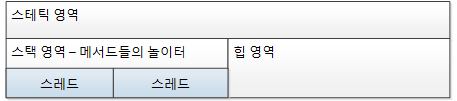
    
    &nbsp;&nbsp;&nbsp;&nbsp;&nbsp;&nbsp;&nbsp;&nbsp;&nbsp;&nbsp;&nbsp;&nbsp;&nbsp;&nbsp;&nbsp;&nbsp;&nbsp;&nbsp;&nbsp;&nbsp;&nbsp;&nbsp;&nbsp;&nbsp;&nbsp;&nbsp;&nbsp;&nbsp;&nbsp;&nbsp;&nbsp;&nbsp;&nbsp;&nbsp;&nbsp;&nbsp;&nbsp;&nbsp;&nbsp;&nbsp;&nbsp;&nbsp;&nbsp;&nbsp;&nbsp;&nbsp;&nbsp;&nbsp;&nbsp;&nbsp;&nbsp;&nbsp;&nbsp;&nbsp;&nbsp;- 멀티쓰레드

### 멀티 프로세스(Multi Process)란?
- 다수의 데이터 저장 영역을 갖는 것으로 다수의 T 메모리를 갖는 구조
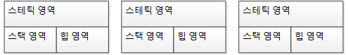

&nbsp;&nbsp;&nbsp;&nbsp;&nbsp;&nbsp;&nbsp;&nbsp;&nbsp;&nbsp;&nbsp;&nbsp;&nbsp;&nbsp;&nbsp;&nbsp;&nbsp;&nbsp;&nbsp;&nbsp;&nbsp;&nbsp;&nbsp;&nbsp;&nbsp;&nbsp;&nbsp;&nbsp;&nbsp;&nbsp;&nbsp;&nbsp;&nbsp;&nbsp;&nbsp;&nbsp;&nbsp;&nbsp;&nbsp;&nbsp;&nbsp;&nbsp;&nbsp;&nbsp;&nbsp;&nbsp;&nbsp;&nbsp;&nbsp;&nbsp;&nbsp;&nbsp;&nbsp;&nbsp;&nbsp;&nbsp; - 멀티프로세스

---
## **참고사항**
### 1. 3-1)Java . Lang 패키지
- 자바는 기본적으로 다양한 패키지를 지원한다.
- java.lang 패키지는 Import없이 사용가능한 기본이되는 가장 중요한 패키지이다.

1. java.lang 패키지의 클래스는 import를 하지 않고도 사용할 수 있다.
2. java.lang 패키지에는 기본형타입을 객체로 변환시킬때 사용하는 Wrapper클래스가 있다.Boolean, Byte, Short, Integer, Long, Float, Double 클래스
3. 모든 클래스의 최상위 클래스인 Object도 java.lang패키지
4. 문자열과 관련된 String, StringBuffer, StringBuilder도 모두 java.lang패키지
5. 화면에 값을 출력할때 사용했던 System 클래스도 java.lang패키지
6. 수학과 관련된 Math 클래스도 java.lang패키지
7. Thread와 관련된 중요 클래스들이 java.lang패키지


### 2-1. 스택 프레임이란?
- 스택 프레임은 이름 그대로 위로 쌓이는 틀
- 틀(스택 프레임)은 여는 중괄호로 생성이 되고 닫는 중괄호로 소멸된다.


### 2-2. **지역변수** 란?
- 특정한 구역({})안에 생성되어 그 지역에만 사용할 수 있는 변수

### 2-2. **전역변수** 란?
- 전체에서 어디서든 호출하면 사용할수 있는 변수

---
### 궁금했던 점
1. 프로그램이 실행되는 시작점인 main() 메서드는 static으로 선언되어 있을까?
- 궁금증 해결: 기본적으로 처음 프로그램이 실행되면, 스태틱 영역에 클래스들이 모두 올라가게된다. 이때, 클래스 메서드(=스태틱 메서드=정적 메서드)가 아닌 객체 메서드라면 객체가 힙 영역에 생성된 이후에 사용이 가능하기 때문이다.
    - main() 메서드를 static으로 선언하지 않으면 객체 메서드가 되어 main() 메서드가 존재하는 클래스의 객체가 생성된 후 실행이 가능

2. 변수는 T 메모리 영역 중 어느 곳에 있을 수 있을까?
- 궁금증 해결: 변수의 종류에 따라 다른 영역에 생성된다.
    - 지역변수: 스택 영역의 스택 프레임 안에서 계속있게되며, 스택 프레임이 사라지면 함께 사라진다.
    - 클래스 멤버 변수: 스태틱 영역에서 계속있게되며, JVM이 종료될 때까지 고정된(static)상태로 존재한다.
    - 객체 멤버 변수: 힙 영역에서 계속있게되며, 객체와 함께 가비지 컬렉터(GC)에 의해 힙 메모리 회수기에 의해 사라진다.
        
        **참고 사항**
        - 가비지 컬렉션(Garbage Collection)(GC): 메모리 관리 방법 중에 하나로, 시스템에서 데이상 사용하지 않는 동적 할당된 메모리 블럭을 찾아 자동으로 다시 사용 가능한 자원으로 회수하는 것
        - 가비지 컬렉터(GC 작업을 한다): 하는 일- 1. 메모리 할당, 2. 사용 중인 메모리 인식, 3. 사용하지 않는 메모리 인식