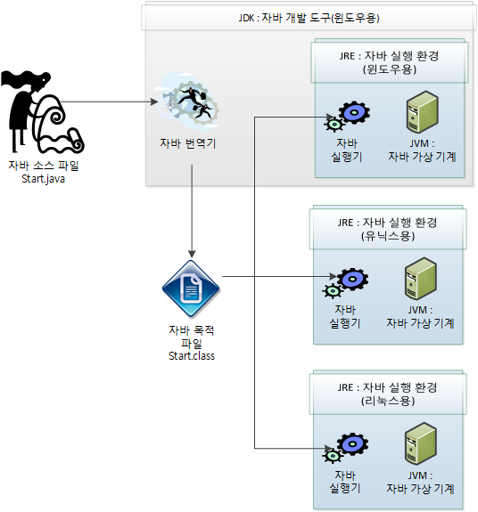
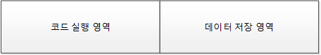
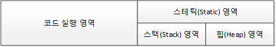
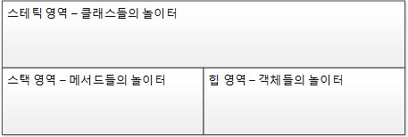
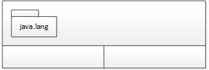
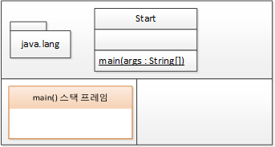
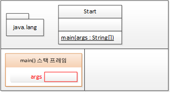
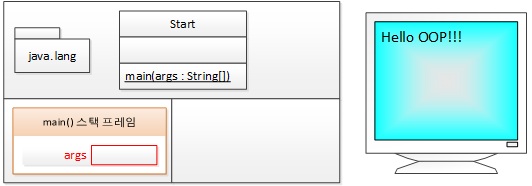
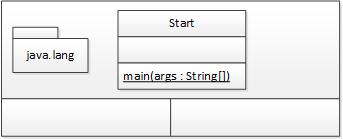
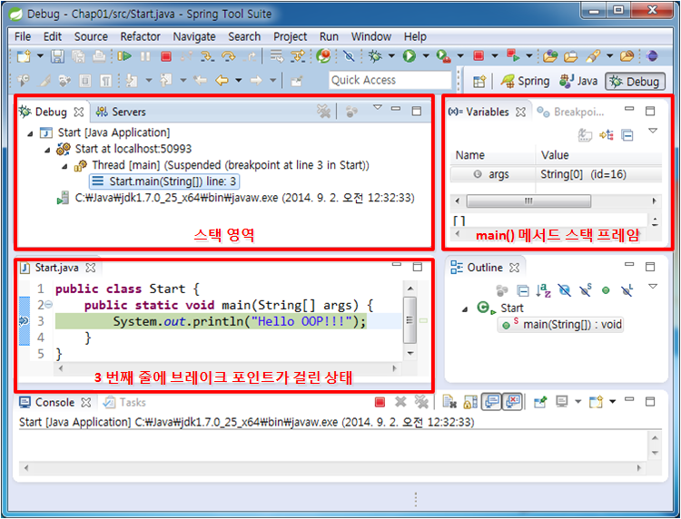

자바와 절차적/구조적 프로그래밍
==
## 자바 프로그램의 개발과 구동


1. JDK
    - Java Development Kit/ 자바 개발 도구
    - 자바 소스 컴파일러인 javac.exe를 포함

2. JRE
    - Java Runtime Environment / 자바 실행 환경
    - 자바 프로그램 실행기인 java.exe를 포함
3. JVM
    - Java Virtual Machine / 자바 가상 기계
    - 중재자로서 각 플랫폼에서 프로그램을 구동하는 데 아무 문제가 없게끔 만들어준다.

### 프로그램이 메모리를 사용하는 방식

- 프로그램이 실행될 때 메모리를 사용하는 방식

### 객체 지향 프로그램의 메모리 사용 방식

- 데이터 저장 영역은 삼분할로 되어있어 T메모리 구조라고 지칭한다.

### Main() 메서드: 메서드 스택 프레임
- main() 메서드는 프로그램이 실행되는 시작점

#### main() 메서드가 실행될 때 메모리의 변화
ex> 예제 Start.java
```java
public class Start {
	public static void main(String[] args) {
		System.out.println("Hello OOP!!!");
	}
}
```


1. main() 메서드가 실행되기 전 JVM에서 수행하는 전처리 작업들
- java.lang 패키지를 T 메모르의 스태틱 영역에 배치한다.
- import된 패키지를 T 메모리의 스태틱 영역에 배치한다.
- 프로그램 상의 모든 클래스를 T 메모리의 스태틱 영역에 배치한다.
- 그림참조




1. main() 메서드 스택 프레임
- 스택 프레임이 스택 영역에 할당된다.
- 중괄호를 만날 때마다 스택 프레임이 하나씩 생긴다(단, 클래스 정의를 시작하는 중괄호는 제외)
- 그림참조
  


- 메서드의 인자의 변수 공간을 할당해야한다.


- 명령문 실행(Hello OOP!!! 출력)

  

- main() 메서드 종료 이후의 T메모리 상태(스택 프레임이 소멸된다.)



### Debug를 이용한 T메모리 스택 영역의 상태확인

- 3번쨰 줄에 브레이크 포인트를 설정.
- Run -> Debug를 실행 했을 때의 Debug 퍼스펙티브를 확인.
- 상단 좌측은 스택영역을 유추해 볼 수 있다.
- 상단 우측에서 main() 메서드 스택 프레임 내부의 지역 변수를 확인할 수 있다.


## 변수와 메모리

