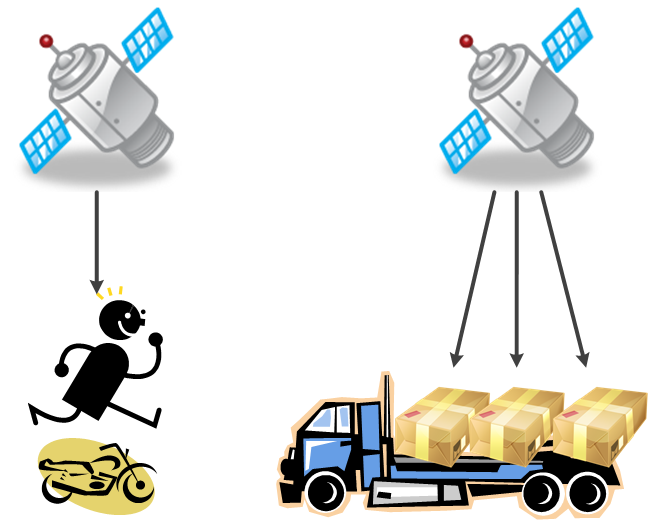

3장 : 자바와 객체 지향
==

# 1. 객체(object)와 클래스(class)

- **클래스(Class)** : 같은 속성과 기능을 가진 객체를 총칭하는 개념(사물을 분류/집합)
- **객체(Object)** : 세상에 존재하는 모든 고유한 사물(실체/개체) 

### 클래스와 객체를 간단히 구분하는 법 

- 생물인 경우 : "나이가 어떻게 되나요?"
    - 사람의 나이는 몇살인가요? -> 대답 불가(클래스)
    - 김연아의 나이는 몇살인가요? -> 1990년생으로 34살(객체)
- 무생물인 경우 : "제조년월이 어떻게 되나요?"
    - 과자의 제조년월은 언제인가요? -> 대답 불가(클래스)
  
클래스와 객체를 작명할 때도 ***클래스***는 **분류**로, ***객체 참조 변수명***은 **유일무이한 사물**의 이름으로 작명해야 한다.
* Mouse jerry = new Mouse(); - ***객체 참조 변수명을 잘 작성한 예시***
    * Mouse의 나이는? - Mouse는 **분류**의 개념이기 때문에 해당 질문에 답할 수 없기 때문에 Class이다.
    
    * jerry의 나이는? - jerry는 **유일무이한 객체**이므로 해당 질문에 답할 수 있기 때문에 객체스럽게 작명한 것이다.

* 조류 bird = new 조류(); - ***객체 참조 변수명을 잘못 작성한 예시***
    * 조류의 나이는? - 조류는 **분류**의 개념이기 때문에 해당 질문에 답할 수 없기 때문에 Class이다.
    
    * bird의 나이는? - bird 또한 **분류**의 개념이기 때문에 해당 질문에 답할 수 없기 때문에 Class이다.

---

# 2. 객체 지향의 4대 특성 
- 책에서는 캡!상추다라고 하여 좀 더 외우기 쉽도록 하였다.
    - 캡 : 캡슐화(Encapsulation) => 정보 은닉
    - 상 : 상속(재사용)
    - 추 : 추상화(Abstraction) => 모델링
    - 다 : 다형성(Polymorphism) => 사용 편의성
<br><br>

## 1)캡슐화(Encapsulation) : 정보 은닉

### 정보 은닉(Inforamtion Hiding)은 접근 제어자를 통한 접근 제한을 의미

### 접근 제어자 : private, [default], protected, public

- private : 본인만 접근 가능
- [default] : **같은 패키지** 내의 클래스에서 접근 가능
- protected : **상속 / 같은 패키지** 내의 클래스에서 접근 가능
- public : 모두가 접근 가능

&nbsp;&nbsp;&nbsp;&nbsp;&nbsp;&nbsp;&nbsp;&nbsp;&nbsp;&nbsp;

&nbsp;&nbsp;&nbsp;&nbsp;&nbsp;&nbsp;&nbsp;&nbsp; - [그림설명]접근 제어자(private인 경우 같은 클래스의 객체끼리는 서로 접근 가능)

### 접근 제어자가 객체 멤버(인스턴스 멤버)일 때와 정적 멤버(클래스 멤버)와 함께 쓰일 때 비교
- -: private
- ~: default
- #: protected
- +: public
- 밑즐: static 멤버
- 비어있는 화살표 + 실선: 상속(화살촉이 상위 클래스)

### 객체 멤버(인스턴스 멤버)와 접근 제어자


&nbsp;&nbsp;&nbsp;&nbsp;&nbsp;&nbsp;&nbsp;&nbsp;&nbsp;&nbsp;&nbsp;&nbsp;&nbsp;&nbsp;&nbsp;&nbsp;&nbsp;&nbsp;&nbsp;&nbsp;&nbsp;&nbsp;&nbsp;&nbsp;&nbsp;&nbsp;&nbsp;&nbsp;&nbsp;&nbsp;&nbsp;&nbsp;&nbsp;&nbsp;&nbsp;&nbsp;&nbsp; -[그림설명]객체 멤버와 접근 제어자

- 위 구조로 패키지 및 클래스가 구성되어 있을 때, ClassA의 객체 멤버에 접근권한이 어떤 항목까지 있을지 정리


&nbsp;&nbsp;&nbsp;&nbsp;&nbsp;&nbsp;&nbsp;&nbsp;&nbsp;&nbsp;&nbsp;&nbsp;&nbsp;&nbsp;&nbsp;&nbsp;&nbsp;&nbsp;&nbsp;&nbsp;&nbsp;&nbsp;&nbsp;&nbsp;&nbsp;&nbsp;&nbsp;&nbsp;&nbsp;&nbsp;&nbsp;&nbsp;&nbsp;&nbsp;&nbsp;&nbsp;&nbsp;&nbsp;&nbsp;&nbsp;&nbsp;&nbsp;&nbsp;&nbsp;&nbsp;&nbsp;&nbsp;&nbsp;&nbsp;&nbsp;&nbsp;&nbsp;&nbsp;&nbsp;&nbsp;&nbsp;&nbsp;&nbsp;&nbsp;&nbsp;&nbsp;&nbsp;&nbsp;&nbsp;&nbsp;- [그림설명]객체 멤버와 접근제어자

- 상속을 받지 않았다면 객체 맴버는 객체를 생성한 후 객체 참조 변수를 이용해 접근해야 한다.
  

### 정적 멤버(클래스 멤버, static 멤버)와 접근 제어자


&nbsp;&nbsp;&nbsp;&nbsp;&nbsp;&nbsp;&nbsp;&nbsp;&nbsp;&nbsp;&nbsp;&nbsp;&nbsp;&nbsp;&nbsp;&nbsp;&nbsp;&nbsp;&nbsp;&nbsp;&nbsp;&nbsp;&nbsp;&nbsp;&nbsp;&nbsp;&nbsp;&nbsp;&nbsp;&nbsp;&nbsp;&nbsp;&nbsp;&nbsp;&nbsp;&nbsp;&nbsp; -[그림설명]정적 멤버와 접근 제어자

- 위 구조로 패키지 및 클래스가 구성되어 있을 때, ClassA의 객체 멤버에 접근권한이 어떤 항목까지 있을지 정리


&nbsp;&nbsp;&nbsp;&nbsp;&nbsp;&nbsp;&nbsp;&nbsp;&nbsp;&nbsp;&nbsp;&nbsp;&nbsp;&nbsp;&nbsp;&nbsp;&nbsp;&nbsp;&nbsp;&nbsp;&nbsp;&nbsp;&nbsp;&nbsp;&nbsp;&nbsp;&nbsp;&nbsp;&nbsp;&nbsp;&nbsp;&nbsp;&nbsp;&nbsp;&nbsp;&nbsp;&nbsp;&nbsp;&nbsp;&nbsp;&nbsp;&nbsp;&nbsp;&nbsp;&nbsp;&nbsp;&nbsp;&nbsp;&nbsp;&nbsp;&nbsp;&nbsp;&nbsp;&nbsp;&nbsp;&nbsp;&nbsp;&nbsp;&nbsp;&nbsp;&nbsp;&nbsp;&nbsp;&nbsp;&nbsp;- [그림설명]정적 멤버와 접근제어자

- 정적 멤버인 경우 **클래스명.정적멤버** 형식으로 접근하는 것을 권장한다.
    - 클래스명.정적멤버 : 사람.인구수 / 펭귄.다리개수 -> O
    - 객체명.정적멤버 : 홍길동.인구수 /  뽀로로.다리개수 -> X
- 일관된 형식으로 접근하기 위함
- 메모리 접근 방식에 있어서도 클래스명.정적멤버 형식이 더 유리하다.(객체.정적멤버로 접근할 경우 먼저 객체 참조 변수를 이용해 힙 영역의 객체를 갔다가 스태틱 영역에 가야한다.)

&nbsp;&nbsp;&nbsp;&nbsp;&nbsp;&nbsp;&nbsp;&nbsp;&nbsp;&nbsp;&nbsp;

&nbsp;&nbsp;&nbsp;&nbsp;&nbsp;&nbsp;&nbsp;&nbsp;&nbsp;&nbsp;&nbsp;&nbsp;&nbsp;&nbsp;&nbsp;&nbsp;&nbsp;&nbsp;-[그림설명] 정적 멤버를 클래스.정적멤버로 접근하는게 메모리 접근에 더 효율적

---
## 2)상속 : 재사용과 확장 : extends

- 객체 지향에서 상속은 상위 클래스의 특성을 하위 클래스에서 상속(특성 상속,재사용)하고 추가로 필요한 특성을 더하는 확장한다는 의미이다.
    - 동물은 포유류의 부모가 아니며, 참새의 부모가 조류는 아니다.
    

    &nbsp;&nbsp;&nbsp;&nbsp;&nbsp;&nbsp;&nbsp;&nbsp;&nbsp;&nbsp;&nbsp;&nbsp;&nbsp;&nbsp;&nbsp;&nbsp;&nbsp;&nbsp;&nbsp;&nbsp;&nbsp;&nbsp;&nbsp;&nbsp;&nbsp;&nbsp;&nbsp;&nbsp;&nbsp; - [그림설명] 객체 지향의 상속에 대한 올바른 예 - 분류도

### 상속과 관계
- 상속 관계에서 반드시 만족해야 할 문장 : **하위 클래스는 상위 클래스**이다.
- 상속은 **is a kind of** 관계를 만죡해야 한다.
    - 펭귄 is kind of 동물 -> 펭귄은 동물의 한 분류입니다.
    - 조류 is kind of 동물 -> 조류은 동물의 한 분류입니다.
    - 고양이 is kind of 동물 -> 고양이은 동물의 한 분류입니다.

### 상속과 인터페이스

자바는 다중 상속을 지원하지 않는 대신에 인터페이스를 지원한다.
- 인터페이스: 구현 클래스 **is able to** 인터페이스 -> 구현 클래스는 인터페이스할 수 있다.
- 상위 클래스는 하위 클래스에게 특성(속성과 메서드)를 상속해준다.
- 인터페이스는 클래스가 '무엇을 할 수 있다'라는 기능을 구현하도록 강제하게 된다.


&nbsp;&nbsp;&nbsp;&nbsp;&nbsp;&nbsp;&nbsp;&nbsp;&nbsp;&nbsp;&nbsp;&nbsp;&nbsp;&nbsp;&nbsp;&nbsp;&nbsp;&nbsp;&nbsp;&nbsp;&nbsp;&nbsp;&nbsp;&nbsp;&nbsp;&nbsp;&nbsp;&nbsp;&nbsp;&nbsp;&nbsp;&nbsp;&nbsp;&nbsp;&nbsp;&nbsp;&nbsp;&nbsp;&nbsp;&nbsp;&nbsp;&nbsp;-[그림설명]인터페이스 예시

### 상속과 T 메모리 구조
```java
package inheritance03;

public class Animal {
	public String name;

	public void showName() {
		System.out.printf("안녕 나는 %s야. 반가워\n", name);
	}
}
```
```java

package inheritance03;

public class Penguin extends Animal {
	public String habitat;

	public void showHabitat() {
		System.out.printf("%s는 %s에 살아\n", name, habitat);
	}
}
```
```java
package inheritance03;

public class Driver {
	public static void main(String[] args) {  // 3번째줄
		Penguin pororo = new Penguin();

		pororo.name = "뽀로로";
		pororo.habitat = "남극";

		pororo.showName();
		pororo.showHabitat();

		Animal pingu = new Penguin(); // 11번째 줄

		pingu.name = "핑구";
		// pingu.habitat = "EBS";
        /* 형변환을 이용하여 habitat 호출할 수 있긴하다.
        Penguin newPingu = (Penguin)pingu;
        newPingu.habitat = "EBS";
        newPingu.showHabitat();
        */
		pingu.showName();
		// pingu.showHabitat();

		// Penguin happyfeet = new Animal();
	}
}
```
- main() 메서드가 실행하게 되며 main() 메서드의 3번째 줄을 실행하면, 아래 그림과 같이 Penguin 객체와 Penguin 클래스가 상속 받은 Animal 객체가 함께 힙 영역에 생긴다.
    - 그림에는 생략되었지만, 가장 최상단 상속 클래스인 Object 클래스의 인스턴스 역시 힙 역역에 생성된다.


&nbsp;&nbsp;&nbsp;&nbsp;&nbsp;&nbsp;&nbsp;&nbsp;&nbsp;&nbsp;&nbsp;&nbsp;&nbsp;&nbsp;&nbsp;&nbsp;&nbsp;&nbsp;&nbsp;&nbsp;&nbsp;&nbsp;&nbsp;&nbsp;&nbsp;&nbsp;&nbsp;&nbsp;&nbsp;&nbsp;&nbsp;&nbsp;&nbsp;&nbsp;&nbsp;&nbsp;&nbsp;&nbsp;&nbsp;-[그림설명] Penguin pororo = new Penguin() 실행

- 이어서, 11번째 줄을 실행하게 되면, 힙 영역에는 Penguin과 Animal 객체가 2서트가 존재하게 된다.


&nbsp;&nbsp;&nbsp;&nbsp;&nbsp;&nbsp;&nbsp;&nbsp;&nbsp;&nbsp;&nbsp;&nbsp;&nbsp;&nbsp;&nbsp;&nbsp;&nbsp;&nbsp;&nbsp;&nbsp;&nbsp;&nbsp;&nbsp;&nbsp;&nbsp;&nbsp;&nbsp;&nbsp;&nbsp;&nbsp;&nbsp;&nbsp;&nbsp;-[그림설명] Animal pingu = new Animal() 실행

- pingu 객체 참조 변수는 pororo 객체 참조 변수와 다르게 Animal 객치를 가리킨다. 이는, Penguin 객체를 생성할 때 객체 참조 변수 타입을 Animal로 지정했기 때문이다.
    - pingu 객체 참조 변수는 pororo 객체 참조 변수와 다르게 habitat 정보를 초기화할 수도, habitat 정보를 보여줄 수도 없다. -> 형변환 연산을 생각해볼 수도 있겠지만, 여기서는 위 로직 그대로 사용한다는 가정하에서는 사용할 수 없다.

---
## 3)추상화(Abstraction) : 모델링
- 구체적인 것을 분해해서 관심 영역(어플리케이션 경계)에 있는 특성만 가지고 재조합 하는 것(모델링)
- 자바는 객체 지향의 추상화를 class 키워드를 통해 지원한다.


&nbsp;&nbsp;&nbsp;&nbsp;&nbsp;&nbsp;&nbsp;&nbsp;&nbsp;&nbsp;&nbsp;&nbsp;&nbsp;&nbsp;&nbsp;&nbsp;&nbsp;&nbsp;&nbsp;&nbsp;&nbsp;&nbsp;&nbsp;&nbsp;&nbsp;&nbsp;&nbsp;&nbsp;&nbsp;&nbsp;&nbsp;&nbsp;&nbsp;&nbsp;&nbsp;&nbsp;&nbsp;&nbsp;&nbsp;&nbsp;-[그림설명] 객체의 생성과 클래스,객체 참조 변

### 추상화와 T 메모리 구조
```java
public class Mouse {
    public String name;
    public int age;
    public int countOfTail;
    
    public void sing() {
        System.out.println("찍찍 울어요");
    }
}
```
- 쥐라는 클래스를 만들 때, 애니메이션 속 쥐의 특징에 맞는 항목들에 대해서만(어플리케이션 경계) 클래스 작성 시 넣으면 된다.

```java
public class MouseDriver {
    public static void main(String[] args) {
        Mouse mickey = new Mouse();  // 3번째 줄
        mickey.name = "미키";
        mickey.age = 85;
        mickey.countOfTail = 1;
        
        mickey.sing();
        
        mickey = null; // 10번째 줄 
        
        Mouse jerry = new Mouse();
        jerry.name = "제리";
        jerry.age = 73;
        jerry.countOfTail = 1;
        
        jerry.sing();
    }
}
```

- MouseDriver.main() 메서드를 시작점으로 실행된 후, 3번째 줄이 실행되기 직전의 T 메모리 구조는 아래그림과 같다.

&nbsp;&nbsp;&nbsp;&nbsp;&nbsp;&nbsp;&nbsp;&nbsp;&nbsp;&nbsp;&nbsp;&nbsp;

&nbsp;&nbsp;&nbsp;&nbsp;&nbsp;&nbsp;&nbsp;&nbsp;&nbsp;&nbsp;&nbsp;&nbsp;&nbsp;&nbsp;&nbsp;&nbsp;&nbsp;&nbsp;&nbsp; -스태틱 영역만 할당된 상태

- T 메모리 구조를 보면, java.lang 패키지 및 사용되는 클래스들에 대해 스태틱 영역에 배치되었다.
- Mouse클래스를 보면, name,age,countOfTail이라는 변수명은 적혀있지만, 따로 변수의 값이 할당된 공간이 없다.
- 이것은 이 3개의 속성이 Mouse 클래스의 속성이 아닌 Mouse 객체의 속성이기 때문이다.
    - 객체의 속성의 변수 저장 공간은 객체가 생성된 후 힙 영역에 할당된다.
    - T 메모리 구조에서 밑줄이 그어진 변수 또는 메서드는 클래스 멤버(static)이며, 밑줄이 없는 경우 객체 멤버이다.

- 3번째 줄의 Mouse mickey = new Mouse();를 실행하게 되면 아래 그림과 같은 순서에 의해 실행된다.

&nbsp;&nbsp;&nbsp;&nbsp;&nbsp;&nbsp;&nbsp;&nbsp;&nbsp; 

&nbsp;&nbsp;&nbsp;&nbsp;&nbsp;&nbsp;&nbsp;&nbsp;&nbsp;&nbsp;&nbsp;&nbsp;&nbsp;&nbsp;&nbsp;&nbsp;&nbsp;&nbsp;&nbsp;&nbsp;&nbsp;&nbsp;&nbsp;&nbsp;&nbsp;&nbsp;&nbsp;&nbsp;&nbsp;&nbsp;&nbsp;&nbsp;&nbsp;&nbsp;&nbsp;&nbsp;&nbsp;&nbsp;&nbsp;&nbsp;&nbsp;&nbsp;&nbsp;&nbsp;&nbsp;&nbsp;&nbsp;&nbsp;&nbsp;&nbsp;&nbsp;-[그림1]

&nbsp;&nbsp;&nbsp;&nbsp;&nbsp;&nbsp;&nbsp;&nbsp;&nbsp; 

&nbsp;&nbsp;&nbsp;&nbsp;&nbsp;&nbsp;&nbsp;&nbsp;&nbsp;&nbsp;&nbsp;&nbsp;&nbsp;&nbsp;&nbsp;&nbsp;&nbsp;&nbsp;&nbsp;&nbsp;&nbsp;&nbsp;&nbsp;&nbsp;&nbsp;&nbsp;&nbsp;&nbsp;&nbsp;&nbsp;&nbsp;&nbsp;&nbsp;&nbsp;&nbsp;&nbsp;&nbsp;&nbsp;&nbsp;&nbsp;&nbsp;&nbsp;&nbsp;&nbsp;&nbsp;&nbsp;&nbsp;&nbsp;&nbsp;&nbsp;&nbsp;-[그림2]

&nbsp;&nbsp;&nbsp;&nbsp;&nbsp;&nbsp;&nbsp;&nbsp;&nbsp;

&nbsp;&nbsp;&nbsp;&nbsp;&nbsp;&nbsp;&nbsp;&nbsp;&nbsp;&nbsp;&nbsp;&nbsp;&nbsp;&nbsp;&nbsp;&nbsp;&nbsp;&nbsp;&nbsp;&nbsp;&nbsp;&nbsp;&nbsp;&nbsp;&nbsp;&nbsp;&nbsp;&nbsp;&nbsp;&nbsp;&nbsp;&nbsp;&nbsp;&nbsp;&nbsp;&nbsp;&nbsp;&nbsp;&nbsp;&nbsp;&nbsp;&nbsp;&nbsp;&nbsp;&nbsp;&nbsp;&nbsp;&nbsp;&nbsp;&nbsp;&nbsp;-[그림3]

  1. Mouse mickey를 실행함으로써  main()스택 프레임에 mickey라고 하는 객체 참조 변수 공간 생성(그림 1)
  2. new Mouse()를 실행함으로써 Mouse 객체가 생성되어, 힙 영역에 Mouse 클래스의 인스턴스 생성(그림 2)
  3. mickey라는 객체 참조 변수의 값은 Mouse 객체의 위치(주소값)를 값으로 초기화(그림 3)

- 10번째 줄까지 실행하게 되면, 기존에 생성한 Mouse 객체와 mickey와의 연결이 끊어진다.
- mickey에 null을 대입하여 Mouse 객체와 연결이 끊어져도, Mouse 객체는 힙 영역에서 제거될 수도 있고, 안될 수도 있다.
- 제거되었다고 가정하고 10번째 줄 이후까지 실행하여 12번째 줄까지 실행되면 아래 그림 3과 같은 형태가 된다.
    - 가비지 컬렉터(GC, Garbage Collector)에 의해 아무도 참조하지 않는 힙 영역의 객체를 제거해준다.
    - 하지만 가비지 컬렉터가 언제 올지는 알 수 없다.

&nbsp;&nbsp;&nbsp;&nbsp;&nbsp;&nbsp;&nbsp;&nbsp;&nbsp;

&nbsp;&nbsp;&nbsp;&nbsp;&nbsp;&nbsp;&nbsp;&nbsp;&nbsp;&nbsp;&nbsp;&nbsp;&nbsp;&nbsp;&nbsp;&nbsp;&nbsp;&nbsp;&nbsp;&nbsp;&nbsp;&nbsp;&nbsp;&nbsp;&nbsp;&nbsp;&nbsp;&nbsp;&nbsp;&nbsp;&nbsp;&nbsp;&nbsp;&nbsp;&nbsp;&nbsp;&nbsp;&nbsp;&nbsp;&nbsp;&nbsp;&nbsp;&nbsp;&nbsp;&nbsp;&nbsp;&nbsp;&nbsp;&nbsp;&nbsp;&nbsp;-[그림1]

&nbsp;&nbsp;&nbsp;&nbsp;&nbsp;&nbsp;&nbsp;&nbsp;&nbsp;

&nbsp;&nbsp;&nbsp;&nbsp;&nbsp;&nbsp;&nbsp;&nbsp;&nbsp;&nbsp;&nbsp;&nbsp;&nbsp;&nbsp;&nbsp;&nbsp;&nbsp;&nbsp;&nbsp;&nbsp;&nbsp;&nbsp;&nbsp;&nbsp;&nbsp;&nbsp;&nbsp;&nbsp;&nbsp;&nbsp;&nbsp;&nbsp;&nbsp;&nbsp;&nbsp;&nbsp;&nbsp;&nbsp;&nbsp;&nbsp;&nbsp;&nbsp;-[그림2]

&nbsp;&nbsp;&nbsp;&nbsp;&nbsp;&nbsp;&nbsp;&nbsp;&nbsp;

&nbsp;&nbsp;&nbsp;&nbsp;&nbsp;&nbsp;&nbsp;&nbsp;&nbsp;&nbsp;&nbsp;&nbsp;&nbsp;&nbsp;&nbsp;&nbsp;&nbsp;&nbsp;&nbsp;&nbsp;&nbsp;&nbsp;&nbsp;&nbsp;&nbsp;&nbsp;&nbsp;&nbsp;&nbsp;&nbsp;&nbsp;&nbsp;&nbsp;&nbsp;&nbsp;&nbsp;&nbsp;&nbsp;&nbsp;&nbsp;&nbsp;&nbsp;&nbsp;&nbsp;&nbsp;&nbsp;&nbsp;&nbsp;&nbsp;&nbsp;&nbsp;-[그림3]

### 클래스 멤버(static 멤버, 정적 멤버) VS 객체 멤버(인스턴스 멤버)

-앞선 예시를 통해 클래스는 개념이면서 분류체계이기 때문에 속성에 대한 값을 가질 수 없는 것을 확인하였다.
- 다만, 해당 클래스에 속하는 객체들이 모두 동일한 값을 가질 경우 클래스를 통해 질문을 해도 동일한 값이 나온다. 이를 **클래스 멤버**라고 한다.
    - 미키마우스(객체)의 꼬리는 몇개인가요? -> 1개
    - 제리(객체)의 꼬리는 몇개인가요? -> 1개
    - 쥐(클래스)의 꼬리는 몇개인가요? -> 1개

- 위 예시의 countOfTail은 객체 멤버로 갖지 않고, 클래스 멤버로 갖도록 할 수 있다.
- 클래스 멤버로 사용하기 위해서는 static 키워드를 사용해야 한다.
    ```java
    public class Mouse {
        public String name;
        public int age;
        public static int countOfTail; // 클래스 멤버(정적 멤버)
        
        public void sing() {
            System.out.println("찍찍 울어요");
        }
    }
    ```
- Mouse 클래스가 변경되면, Mouse 객체를 여러개 생성해도 countOfTail은 스태틱 영역에 변수 공간이 할당될 뿐, 힙 영역에 추가로 변수 공간이 할당되지 않는다.
  - 클래스 멤버의 경우, 객체 참조 변수.클래스멤버로도 접근할 수 있고 클래스명.클래스 멤버로도 접근할 수 있다.
    

    &nbsp;&nbsp;&nbsp;&nbsp;&nbsp;&nbsp;&nbsp;&nbsp;&nbsp;&nbsp;&nbsp;&nbsp;&nbsp;&nbsp;&nbsp;&nbsp;&nbsp;&nbsp;&nbsp;&nbsp;&nbsp;&nbsp;&nbsp;&nbsp;&nbsp;&nbsp;&nbsp;&nbsp;&nbsp;&nbsp;&nbsp;&nbsp;&nbsp;&nbsp;&nbsp;&nbsp;&nbsp;&nbsp;&nbsp;&nbsp;-[그림설명] countOfTail에 static을 붙여 클래스 멤버로 변경


- 위와 같이 정적 속성(static)은 해당 클래스의 모든 객체가 같은 값을 가질 때 사용한다
- 특히, 정적 메서드의 경우 객체들이 존재하지 않아도 사용할 수 있는 메서드로 유틸리티성 메서드를 주로 정적 메서드로 구현한다
    - Math 클래스에 있는 많은 정적 메서드들을 객체를 생성하지 않고 사용한다.
    - main() 메서드는 항상 정적 메서드여야한다.
        - T 메모리가 초기화된 순간 객체는 하나도 존재하지 않아 객체 멤버 메서드로 main() 메서드를 실행할 수 없기 때문이다.

- 클래스 속성 및 객체 속성은 별도로 초기화 하지 않아도 초기화가 된다. -> 공유 변수의 성격

- 클래스 멤버(정적멤버,static 멤버)나 객체 멤버(인스턴스 멤버)의 경우, 따로 초기화를 하지 않으면 아래와 같이 자동으로 초기화가 된다
    - 정수형: 0
    - 부동소수점형:0.0
    - 논리형:false
    - 객체:null

- 스택 영역에 생기는 지역변수와 달리 클래스 멤버와 객체 멤버에 대해 자동으로 초기화해주는 이유는, 이 두 멤버들은 공유 변수의 성격을 띄기 때문이다.
    - 클래스 멤버(정적 멤버)는 어디서든 클래스를 임포트할 수만 있다면 사용할 수 있기 때문에 누가 초기화를 해야할지 정할 수 없다.
    - 객체 멤버는 하나의 객체 안에서 여러 객체 메서드가 공유하는 변수이기 때문에 누가 초기화를 할지 정할 수 없다.
    - 지역 변수는 해당 지역내에서만 사용되고 소멸되기 때문에 초기화를 누가할지 명확하다.
    

    &nbsp;&nbsp;&nbsp;&nbsp;&nbsp;&nbsp;&nbsp;&nbsp;&nbsp;&nbsp;&nbsp;&nbsp;&nbsp;&nbsp;&nbsp;&nbsp;&nbsp;&nbsp;&nbsp;&nbsp;&nbsp;&nbsp;&nbsp;&nbsp;&nbsp;&nbsp;&nbsp;&nbsp;&nbsp;&nbsp;&nbsp;&nbsp;&nbsp;&nbsp;&nbsp;&nbsp;&nbsp;&nbsp;&nbsp;&nbsp;&nbsp;&nbsp;&nbsp;&nbsp;&nbsp;&nbsp;&nbsp;&nbsp;&nbsp;&nbsp;&nbsp;&nbsp;&nbsp;&nbsp;&nbsp;&nbsp;&nbsp;&nbsp;&nbsp;&nbsp;&nbsp;&nbsp;&nbsp;&nbsp;&nbsp;&nbsp;&nbsp;&nbsp;&nbsp;&nbsp;&nbsp;&nbsp;&nbsp;&nbsp;&nbsp;&nbsp;&nbsp;&nbsp;&nbsp;&nbsp;&nbsp;&nbsp;&nbsp;&nbsp;&nbsp;&nbsp;&nbsp;&nbsp;&nbsp;&nbsp;&nbsp;&nbsp;&nbsp;&nbsp;&nbsp;&nbsp;&nbsp;&nbsp;&nbsp;&nbsp;-[그림설명]변수 유형

---
## 4)다형성(Polymorphism) : 사용편의성
- 객체 지향에서 다형성이라고 하면 오버라이딩(overriding)과 오버로딩(overloading)을 얘기할 수 있다.
  
  
  &nbsp;&nbsp;&nbsp;&nbsp;&nbsp;&nbsp;&nbsp;&nbsp;&nbsp;&nbsp;&nbsp;&nbsp;&nbsp;&nbsp;&nbsp;&nbsp;&nbsp;&nbsp;&nbsp;&nbsp;&nbsp;&nbsp;&nbsp;&nbsp;&nbsp;&nbsp;&nbsp;&nbsp;&nbsp;&nbsp;&nbsp;&nbsp;&nbsp;&nbsp;&nbsp;&nbsp;&nbsp;&nbsp;-[그림설명] 올라타기(overriding)와 적재하기(overloading)

- 위 그림을 인공위성 입장에서 내려다 본다고 가정
    - 오버라이딩(overriding) : 오토바이 위에 사람이 올라타 있으면, 오토바이가 아닌 사람만 보인다. -> 맨 위 존재만 보임
        - 같은 메서드 이름, 같은 인자 목록으로 상위 클래스의 메서드를 재정의
    - 오버로딩(overloading) : 트럭에 짐을 여러개 적재하면, 짐들이 모두 보인다.
        - 같은 메서드 이름, 다른 인자 목록으로 다수의 메서드를 중복 정의

### 다형성과 T 메모리 구조
```java
public class Animal {
    public String name;

    public void showName() {
        System.out.printf("안녕 나는 %s야. 반가워\n", name);
    }
}
```
```java
public class Penguin extends Animal {
    public String habitat;	

    public void showHabitat() {
        System.out.printf("%s는 %s에 살아\n", name, habitat);
    }

    //오버라이딩 - 재정의: 상위클래스의 메서드와 같은 메서드 이름, 같은 인자 리스트
    public void showName() {
        System.out.println("어머 내 이름은 알아서 뭐하게요?");
    }

    // 오버로딩 - 중복정의: 같은 메서드 이름, 다른 인자 리스트
    public void showName(String yourName) {
        System.out.printf("%s 안녕, 나는 %s라고 해\n", yourName, name);
	}
}
```
```java
public class Driver {
    public static void main(String[] args) {
        Penguin pororo = new Penguin(); // 3번째 줄

        pororo.name = "뽀로로";
        pororo.habitat = "남극";

        pororo.showName();
        pororo.showName("초보람보");
        pororo.showHabitat();

        Animal pingu = new Penguin(); // 12번째 줄

        pingu.name = "핑구";
        pingu.showName();
    }
}
```
- 코드를 실행하게 되면, main()문이 실행된 후 pororo 객체 참조 변수를 생성하고 Penguin 객체를 만들어 연결(3번째 줄)해주면 아래와 같은 T 메모리 구조를 갖게 된다.
    

    &nbsp;&nbsp;&nbsp;&nbsp;&nbsp;&nbsp;&nbsp;&nbsp;&nbsp;&nbsp;&nbsp;&nbsp;&nbsp;&nbsp;&nbsp;&nbsp;&nbsp;&nbsp;&nbsp;&nbsp;&nbsp;&nbsp;&nbsp;&nbsp;&nbsp;&nbsp;&nbsp;-[그림설명] Penguin pororo = new Pengguin() 실행 후

- Penguin 클래스에서 showName() 메서드를 오버라이딩(overriding)하여 Animal 클래스의 showName() 메서드가 가려졌다
    - 따라서, pororo.showName()을 호출하면 Penguin 클래스에서 재정의한 showName()메서드가 실행된다.
- Penguin 클래스에서 오버로딩(overloading)을 통해 중복 정의한 showName(String)은 Penguin객체에 추가되어 있다.

- 12번째 줄에서 pingu 객체 참조 변수 생성 및 penguin 객체 생성시 T 메모르 구조는 아래와 같다.


&nbsp;&nbsp;&nbsp;&nbsp;&nbsp;&nbsp;&nbsp;&nbsp;&nbsp;&nbsp;&nbsp;&nbsp;&nbsp;&nbsp;&nbsp;&nbsp;&nbsp;&nbsp;&nbsp;&nbsp;&nbsp;&nbsp;&nbsp;&nbsp;&nbsp;&nbsp;&nbsp;&nbsp;&nbsp;&nbsp;&nbsp;&nbsp;&nbsp;&nbsp;&nbsp;&nbsp;&nbsp;&nbsp;-[그림설명] Animal pingu = new Penguin()

- pingu 객체 참조 변수의 타입은 Animal이기 때문에 Animal 객체를 가리킨다.
- 생성한 객체가 penguin 객체이기 때문에 showName() 메서드는 pororo 때와 마찬가지로 Penguin 클래스에서 재정의한 showName()이 호출된다.
    - 상위 클래스 타입의 객체 참조 변수를 사용해도, 하위 클래스에서 오버라이딩(재정의)한 메서드가 호출된다.

---
## 참고사항 ##

### 1. 혼용하여 사용하는 개념
  - 클래스 맴버 = 정적 맴버 = 스태틱 멤버
  - 객체 멤버 = 오브젝트 멤버 = 인스턴스 멤버
  - 필드 = 속성 = 프로퍼티
  - 함수 = 메서드
  - 변수 공간 = 메모리 공간


### 2.3) 어플리케이션 경계(컨텍스트, context)
- 현재 만들고자 하는 범위 내에서의 기능 및 특성에 대해서만 나열하면된다. 


### 2.3) 클래스 객체_참조_변수 = new 클래스();

* 클래스의 인스턴스. 즉, 객체를 생성해서 그 객체의 주소값(포인터)를 객체 참조 변수에 할당
* 객체(Object) = 클래스의 인스턴스(Instance)
* **new 클래스();** -> **클래스의 인스턴스**를 하나 만들어서 **힙(Heap)영역**에 배치한다.
* **멤버 변수(속성)** 은 **공유 변수**의 성격을 가지고 있기 때문에 ***자동으로 초기화***된다. 공유 변수를 딱히 누가 초기화해야 한다고 규정할 수 없기 때문이다.


### 2.4) 역할과 구현을 분리

* 자바 언어의 다형성을 활용
* 역할 = 인터페이스
* 구현 = 인터페이스를 구현한 클래스, 구현 객체
* 객체를 설계할 때 ***역할과 구현을 명확히 분리!!!***
* 객체 설계시 역할(인터페이스)을 먼저 부여하고, 그 역할을 수행하는 구현 객체 만들기

*  인터페이스를 구현한 객체 인스턴스를 **실행 시점**에 **유연**하게 **변경**할 수 있다.
* 다형성의 본질을 이해하려면 **협력**이라는 객체사이의 관계에서 시작해야함
* ***클라이언트를 변경하지 않고, 서버의 구현 기능을 유연하게 변경할 수 있다.***


